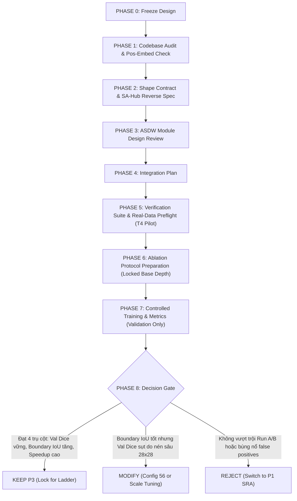

# B2 Experimental Roadmap (SAGE-Lite)

Cập nhật kế hoạch thực nghiệm B2 theo roadmap sau. Mục tiêu là khảo sát có kiểm soát, không mở grid HPO rộng ngay từ đầu.

## Tài Liệu Nền Tảng & Đặc Tả Kỹ Thuật (Foundational References)
* **Kế hoạch Triển khai SAGE-Lite Gốc**: [`SAGE_lite_Implementation_Plan.md`](file:///d:/truong/SpecialSubjectTTNT/SAGE_lite_Implementation_Plan.md) — Đặc tả toàn diện về Backbone lai ConvNeXtV2-Femto + ViT-Tiny (Mục 1), Xử lý Positional Embedding & CLS Token (Mục 2), Standard Conv Decoder (Mục 3), Router Hidden Dim & Exploration Noise (Mục 4), Residual Fusion (Mục 5), SA-Hub Pairwise $O(D^2)$ Adaptation (Mục 6), SAGE Full Injection Logic & Zero-cost Bypass (Mục 7), và Bộ tiền xử lý Canonical Frozen (`img_size=448`) cho Crack500 / DeepCrack (Mục 8).
* **Nhật ký Kỹ thuật & Ghi chú Hệ thống**: [`docs/SAGE_LITE_NOTES.md`](file:///d:/truong/SpecialSubjectTTNT/docs/SAGE_LITE_NOTES.md).
* **Báo cáo Tiền trạm Phần cứng B2 Phase 0 (Tesla T4)**: [`docs/B2_Phase0_Preflight_Log.md`](file:///d:/truong/SpecialSubjectTTNT/docs/B2_Phase0_Preflight_Log.md).

## Nguyên tắc chung

* Không dùng Test set để chọn hyperparameter.
* Validation là tiêu chí chọn cấu hình.
* Mỗi phase chỉ thay đổi nhóm biến cần khảo sát; các biến còn lại giữ nguyên baseline.
* Không tự ý sửa architecture/pipeline chỉ để cải thiện kết quả.
* Ghi lại đầy đủ config, checkpoint, Val Dice và các routing diagnostics cho từng run để có thể truy nguyên thí nghiệm.

## Phase 0 — Runtime preflight (HOÀN TẤT ✅)

Kết quả đo đạc thực tế trên Tesla T4 (14.56 GB usable, AMP FP16, 448×448, ViT Depth 12):
* **Phân biệt rõ hai phép đo Benchmark ở Phase 0**:
  1. **Real-Data Full Training Preflight (Đo lường an toàn bộ nhớ end-to-end)**:
     - **Cấu hình**: Batch 12 thật trên tập Crack500, workers=2, đầy đủ DataLoader, Data Augmentation, Loss, Backward, Optimizer.
     - **Peak Allocated VRAM**: **13.84 GB** (Peak Reserved: 14.05 GB, Free Headroom: **0.51 GB**, 0 memory drift).
     - **End-to-End Training Throughput**: **0.55 samples/s** (tốc độ huấn luyện thực tế đầy đủ pipeline).
     - **Mục đích**: Xác nhận tính khả thi về mặt phần cứng (hardware safety check), chống OOM trên Tesla T4 (14.56 GB usable).
  2. **Targeted Runtime Profiler (SageLayer 0 & 1 Focus, 10 Measured Steps)**:
     - **Cấu hình**: Đo tách bạch vi mô qua CUDA Events trên các bước forward/backward thuần túy của mô hình (không tính độ trễ DataLoader I/O).
     - **Peak Allocated VRAM**: **13.29 GB** (Peak Reserved: 13.61 GB, Free Headroom: ~0.95 GB).
     - **Isolated Compute Throughput**: **2.26 img/s** (~13.98 min / epoch nếu chỉ tính thời gian tính toán mô hình).
     - **Mục đích**: Bóc tách chính xác chi phí từng expert call và xác định căn nguyên 43x slowdown. Tuyệt đối **không dùng con số 2.26 img/s này làm throughput end-to-end** của toàn bộ chu trình huấn luyện.

* **Phát hiện Căn nguyên 43x Slowdown (từ Targeted Profiler)**: Khi ViT Layer gọi ViT Expert ($N=196$), thời gian chỉ **0.79 ms/call**. Nhưng khi các tầng CNN gọi ViT Expert:
  + **Stage 0 $\to$ ViT Expert**: $112 \times 112 = \mathbf{12,544\text{ tokens}}$, thời gian trung bình **33.85 ms/call** (114 calls, tiêu tốn 3,859.1 ms).
  + **Stage 1 $\to$ ViT Expert**: $56 \times 56 = \mathbf{3,136\text{ tokens}}$ (tiêu tốn **34.65 ms/call**, 98 calls, tiêu tốn 3,396.1 ms).
  + **Tổng chi phí 2 tầng**: Stage 0 gọi 114 lần, Stage 1 gọi 98 lần $\implies$ Tổng cộng **212 calls / 7,255.1 ms** (>85% thời gian expert path của 2 tầng này).
  + **Accounting Reconciliation**: Tổng thời gian vi mô khớp **96.9% – 98.3%** thời gian Expert Path (Compute chiếm 91.8% – 94.5%, residual chỉ 1.7% – 3.1%).
* **ViT Scaling vs Local Window Attention Micro-Benchmark**: ✅ **PASS**
  - **Global ViT $\mathcal{O}(N^2)$**: Tại $N=12,544$ và $B=4$, tổng Fwd+Bwd bùng nổ lên **173.07 ms** (chậm gấp **72.2x** so với $N=196$).
  - **Local Window Attention ($W=7$) $\mathcal{O}(N)$**: Chỉ tốn **24.60 ms** tại $N=12,544$ $\implies$ **nhanh hơn 7.04 lần** so với Global ViT. Chi phí giảm từ $0.003449$ xuống $0.000490$ ms/token.
  - **Ranh giới OOM (Stress Test)**: Nhờ PyTorch SDPA, mô hình chịu tải tới 401,408 tokens ($B=32$, Peak VRAM 3.77 GB) mà không OOM, nhưng arithmetic intensity của Global ViT cao gấp 7.2x.
* **Spatial Compression before Global ViT Feasibility Micro-Benchmark**: ✅ **PASS**
  - **Giảm N qua AdaptiveAvgPool**: Từ $112 \times 112$ ($N=12544$, 177.48 ms ở $B=4$), nén xuống $56 \times 56$ ($N=3136$) tốn **15.84 ms (11.21x nhanh hơn)**; nén xuống $28 \times 28$ ($N=784$) chỉ tốn **3.36 ms (52.90x nhanh hơn)**; nén về $14 \times 14$ ($N=196$) tốn **3.16 ms (56.12x nhanh hơn)**.
  - **Tiết kiệm dự kiến**: Có thể cắt giảm tới 90% thời gian gọi ViT expert ở CNN stages mà vẫn giữ nguyên 100% pretrained weights của ViT-Tiny.
* **Kết luận Runtime Batch Size**: **`batch_size: 12`** và **`num_workers: 2`** chính thức được xác nhận khả thi và an toàn cho Full Training trên dữ liệu Crack500 thật.
* Chi tiết log xem tại: `docs/B2_Phase0_Preflight_Log.md` (Mục 9, 10, 11, 12).

| Hạng mục | Kết quả | Ghi chú |
|---|---|---|
| Real Crack500 pipeline | PASS | B2-D12 / top-k=4 / batch_size=12 |
| Batch 12 OOM | Không | Headroom an toàn ~0.51 GB |
| Forward/backward/optimizer | PASS | Đo tách bạch qua CUDA Events |
| Numerical stability | PASS | AMP FP16 không NaN/Inf |
| 16 experts active | PASS | 4.7% – 7.2%, 0 dead experts |
| Peak Alloc VRAM (End-to-End) | **13.84 GB** | Real Crack500 Full Pipeline (Free 0.51 GB) |
| Throughput (End-to-End) | **0.55 samples/s** | Toàn bộ chu trình huấn luyện thật |
| Peak Alloc VRAM (Profiler) | **13.29 GB** | Isolated Compute Profiling |
| Throughput (Profiler) | **2.26 img/s** | Thời gian forward/backward thuần túy |
| Có cần sửa architecture? | **Không** | Baseline B2 vận hành ổn định |

*Lưu ý:* Việc điều chỉnh batch size từ 20 xuống 12 là **hardware-constrained runtime setting**, không phải HPO/tuning result.

---

## Định Hướng Kiến Trúc Cốt Lõi: Tối Ưu Hóa Nút Thắt High-Resolution CNN→ViT (UPDATE 2026-09-24)

Sau khi đánh giá độc lập điểm nghẽn tính toán của các cuộc gọi CNN Stage 0/1 $\to$ ViT expert ($N=12,544$ và $N=3,136$ tokens), thứ tự ưu tiên và định hướng thực nghiệm chính thức được chốt như sau:

### 1. Phân Định Rõ Ràng Thứ Tự Thực Nghiệm (Experiment Execution Sequence)
> [!IMPORTANT]
> **QUY TẮC PHÂN TẦNG THỰC NGHIỆM:**
> 1. **Phase 1 đến Phase 6 trong Roadmap** (ViT Depth $\to$ `top_k` $\to$ Router Hidden Dim $\to$ Load Balancing $\to$ LR/Warmup $\to$ Regularization) là quá trình **KHÓA CẤU HÌNH NỀN TẢNG (Lock Base SAGE-Lite Configuration)**.
> 2. **Nhánh tối ưu nút thắt High-Resolution (P3, P1, P2) TUYỆT ĐỐI KHÔNG ĐƯỢC CHEN VÀO GIỮA các Phase 1–6 này.**
> 3. Chỉ sau khi các biến nền tảng cốt lõi (Base ViT Depth, Best `top_k`, v.v.) đã được xác lập và khóa vững chắc trên tập Validation, mô hình mới chính thức bước sang giai đoạn tối ưu hóa đường truyền High-Resolution CNN $\to$ ViT.
> 4. Thứ tự ưu tiên `P3 (Primary Baseline) -> P1 SRA (Second) -> P2 Restricted Routing (Third)` là thứ tự ưu tiên nội bộ của **NHÓM TỐI ƯU HÓA (Optimization Group)**, hoàn toàn không thay thế hay làm đảo lộn Phase 1–6.
> 5. **Triết Lý Lựa Chọn Chỉ Số Đánh Giá (Metric Selection Design Choice)**:
>    - **Giai đoạn 1 (Base SAGE Lock: Phase 1 đến Phase 6)**: Sử dụng duy nhất **Validation Dice** làm chỉ số chọn lọc cấu hình chính (`sole primary selection metric`). Mục tiêu là khóa kiến trúc tổng thể vững chắc và ổn định nhất.
>    - **Giai đoạn 2 (Nhóm Tối Ưu High-Res: P3, P1, P2)**: Mở rộng đánh giá đồng thời **Val Dice + Boundary IoU + HD95**. Mục tiêu là trực tiếp kiểm chứng giả thuyết bảo tồn cấu trúc hình thái học của vết nứt siêu mảnh trước và sau khi giải quyết nút thắt tính toán.

* **Thứ Tự Ưu Tiên Trong Nhóm Tối Ưu Hóa (Optimization Group Priority)**:
  1. **PRIMARY BASELINE $\to$ Proposal 3: Feature/Detail Enhancement $\to$ Spatial Compression**
  2. **SECOND $\to$ Proposal 1: Spatial Reduction Attention (SRA)**
  3. **THIRD $\to$ Proposal 2: Restricted High-Resolution Routing**

* **Động lực định hướng**: Cân bằng tối ưu tổng thể giữa:
  - Độ chính xác phân đoạn vết nứt (Crack segmentation accuracy trên tập Val).
  - Khả năng bảo tồn chi tiết và vết nứt siêu mảnh (Thin-crack/boundary preservation).
  - Ngữ cảnh tầm xa (Long-range context).
  - Tính tương thích với ViT-Tiny pretrained ImageNet (Black-box preservation).
  - Triết lý định tuyến đa phương thức dị thể của SAGE (Heterogeneous routing).
  - Runtime và VRAM thực tế trên GPU T4.
  - Rủi ro kỹ thuật triển khai (Implementation risk).

---

### 2. Chi Tiết Từng Hướng Kiến Trúc

#### PROPOSAL 3 — PRIMARY BASELINE: Feature/Detail Enhancement $\to$ Spatial Compression

##### 1. Thiết Kế Làm Việc Chính Thức (P3 Final Working Design)
* **Quy trình luồng dữ liệu trọn vòng (Full Round-trip P3 Pipeline)**:
  - **Chiều đi (Forward Path)**:
    + **Stage 0**: $(B, 48, 112, 112) \xrightarrow{\text{ASDW}} (B, 48, 112, 112) \xrightarrow{\text{AvgPool28}} (B, 48, 28, 28) \xrightarrow{\text{Flatten, Transpose}} (B, 784, 48) \xrightarrow{\text{Linear 48}\to 192} (B, 784, 192) \xrightarrow{\text{ViT Global Attn}} (B, 784, 192)$
    + **Stage 1**: $(B, 96, 56, 56) \xrightarrow{\text{ASDW}} (B, 96, 56, 56) \xrightarrow{\text{AvgPool28}} (B, 96, 28, 28) \xrightarrow{\text{Flatten, Transpose}} (B, 784, 96) \xrightarrow{\text{Linear 96}\to 192} (B, 784, 192) \xrightarrow{\text{ViT Global Attn}} (B, 784, 192)$
  - **Chiều về (Reverse Path via SA-Hub)**:
    + **Stage 0**: $(B, 784, 192) \xrightarrow{\text{Linear 192}\to 48} (B, 784, 48) \xrightarrow{\text{Reshape}} (B, 48, 28, 28) \xrightarrow{\text{Bilinear Upsample } 4\times} (B, 48, 112, 112) \xrightarrow{\text{Residual Fusion}} \text{main\_output}$
    + **Stage 1**: $(B, 784, 192) \xrightarrow{\text{Linear 192}\to 96} (B, 784, 96) \xrightarrow{\text{Reshape}} (B, 96, 28, 28) \xrightarrow{\text{Bilinear Upsample } 2\times} (B, 96, 56, 56) \xrightarrow{\text{Residual Fusion}} \text{main\_output}$

* **Công thức chi tiết ASDW-Concat**:

$$
\begin{aligned}
H &= \operatorname{DWConv}_{1 \times 7}(X) \\
V &= \operatorname{DWConv}_{7 \times 1}(X) \\
L &= \operatorname{DWConv}_{3 \times 3}(X) \\
C &= \operatorname{Concat}(H, V, L) \\
C_{\text{act}} &= \operatorname{GELU}(C) \\
F &= \operatorname{PWConv}_{1 \times 1}(C_{\text{act}}) \\
X_{\text{refined}} &= X + \gamma \cdot F \quad (\gamma = 10^{-2})
\end{aligned}
$$

```python
# Cấu hình chi tiết ASDW-Concat (PyTorch equivalent):
# H = DWConv1x7(X, groups=C, padding=(0, 3))
# V = DWConv7x1(X, groups=C, padding=(3, 0))
# L = DWConv3x3(X, groups=C, padding=1)
# C = torch.cat([H, V, L], dim=1)         # Tensor shape: (B, 3C, H, W)
# C_act = F.gelu(C)
# F = PWConv1x1(C_act)                    # Tensor shape: (B, C, H, W)
# X_refined = X + gamma * F               # gamma khởi tạo = 0.01 (learnable scalar)
```

* **Mục tiêu nén không gian (Spatial Targets)**:
  - CNN Stage 0: $112 \times 112 \xrightarrow{\text{AdaptiveAvgPool}} 28 \times 28$ ($N=784$ tokens, giảm $16\times$ số token)
  - CNN Stage 1: $56 \times 56 \xrightarrow{\text{AdaptiveAvgPool}} 28 \times 28$ ($N=784$ tokens, giảm $4\times$ số token)
* **Bất biến kiến trúc bắt buộc (Strict Invariants)**:
  1. **Quy tắc hướng kích hoạt**: CHỈ kích hoạt khi $\text{Source} \in \{\text{CNN Stage 0}, \text{CNN Stage 1}\} \land \text{Target} \in \{\text{ViT Experts}\}$.
  2. **Bảo tồn Main CNN Path**: Main path giữ nguyên $100\%$ độ phân giải cao ($112 \times 112$ và $56 \times 56$) và nuôi trực tiếp Skip connections của Standard Conv Decoder (tuân thủ Mục 3 của [`SAGE_lite_Implementation_Plan.md`](file:///d:/truong/SpecialSubjectTTNT/SAGE_lite_Implementation_Plan.md)).
  3. **Router & Expert Pool bất biến**: Không thay đổi kiến trúc Router (Mục 4), không sửa SA-Hub $O(D^2)$ Pairwise matrix (Mục 6), giữ nguyên cơ chế Zero-cost Bypass (Mục 7 của [`SAGE_lite_Implementation_Plan.md`](file:///d:/truong/SpecialSubjectTTNT/SAGE_lite_Implementation_Plan.md)).
  4. **Pretrained ViT Black-box**: Giữ nguyên khối ViT-Tiny chuẩn pretrained ImageNet, tuyệt đối không can thiệp nội bộ Self-Attention.
  5. **Không dùng BatchNorm & Không Normalization trong bản đầu**: Tuyệt đối không dùng BatchNorm (tránh lỗi batch nhỏ khi route). Đồng thời, **không sử dụng bất kỳ lớp normalization nào (không BN, không LN, không GN) trong bản triển khai P3 đầu tiên** để giữ module tinh gọn tối đa và tránh xáo trộn phân phối đặc trưng trước bước nén.
  6. **Không tiền xử lý RGB**: Tuân thủ $100\%$ Frozen Canonical Preprocessing đã khóa tại Mục 8 của [`SAGE_lite_Implementation_Plan.md`](file:///d:/truong/SpecialSubjectTTNT/SAGE_lite_Implementation_Plan.md) (không dùng Sobel, Laplacian hay can thiệp vào ảnh đầu vào).
  7. **Tách biệt thực nghiệm**: Không thêm CA, LKA, SoftPool, hay Frequency decomposition ở phase đầu tiên để bảo đảm đo đạc độc lập hiệu ứng của ASDW-Concat.
  8. **Nguyên tắc thẩm định bằng chứng**: Tất cả các quyết định lựa chọn checkpoint, so sánh ablation và decision gate **CHỈ ĐƯỢC PHÉP DÙNG TẬP VALIDATION**. Tuyệt đối không dùng tập Test.

---

##### 2. Kế Hoạch Triển Khai Tuần Tự (Phase-by-Phase Execution Plan)



###### PHASE 0 — Freeze Design (Khóa Thiết Kế Ban Đầu)
- **ID**: `P3-PHASE-0`
- **Mục tiêu**: Đóng băng toàn bộ thông số toán học, công thức và bất biến của P3; ghi nhận danh sách các giả thuyết chưa được kiểm chứng.
- **Files liên quan**: `docs/B2_Experimental_Roadmap.md`, `docs/SAGE_LITE_NOTES.md`.
- **Việc cần làm**:
  - Khóa công thức ASDW-Concat: $H(1\times 7), V(7\times 1), L(3\times 3) \to \text{Concat} \to \text{GELU} \to \text{PWConv}(1\times 1) \to \text{Residual}(\gamma=10^{-2})$.
  - Khóa spatial target: $112 \times 112 \to 28 \times 28$ và $56 \times 56 \to 28 \times 28$.
  - Ghi nhận các giả thuyết chưa chứng minh: (1) Khả năng pre-emphasis của ASDW cứu được thin-crack sau khi lấy trung bình $4\times 4$; (2) Kernel 7 phù hợp đồng thời cho cả Stage 0 và Stage 1; (3) Concat 3 nhánh không bị redundancy trên background.
  - **Ràng buộc triển khai Positional Encoding**: Cơ chế xử lý Positional Encoding cho chuỗi 784 tokens là một **ràng buộc mức triển khai (implementation constraint)** đang chờ kiểm định dứt khoát tại Phase 1; tuyệt đối không tự ý đưa vào các giải pháp kiến trúc thay thế ngoài roadmap mà chưa cập nhật văn bản này.
- **Input / Output kiểm tra**:
  - Input: Báo cáo audit `p3_asdw_decision_review.md`.
  - Output: Bản đặc tả thiết kế bất biến được ký duyệt trong roadmap (ngoại trừ cơ chế xử lý positional encoding ở mức implement chờ Phase 1 audit).
- **Acceptance Criteria**: Toàn bộ đội ngũ và tài liệu đồng nhất $100\%$ về công thức và các ràng buộc cấm.
- **Verification / Test**: Review chéo tài liệu, kiểm tra không còn mâu thuẫn giữa roadmap và note.
- **Artifact / Log**: `docs/B2_Experimental_Roadmap.md`.
- **Status**: **FROZEN (ngoại trừ cơ chế Positional Encoding chờ Phase 1 audit) ✅**

###### PHASE 1 — Codebase Audit, Positional Encoding & Execution Path Verification
- **ID**: `P3-PHASE-1`
- **Mục tiêu**: Lập bản đồ luồng thực thi thực tế trong code SAGE-Lite để xác định điểm can thiệp chính xác; **xác nhận cả token-count compatibility VÀ hành vi positional encoding cho chuỗi $N=784$ tokens**.
- **Files liên quan**: `sage_lite/sage/components/sage_layer.py`, `sage_lite/sage/components/sa_hub.py`, `sage_lite/sage/networks/convnextv2_vit_hybrid.py`, `sage_lite/sage/networks/sage_injection.py`.
- **Việc cần làm**:
  - Trace luồng tensor tại `SageLayer._execute_expert_path()` khi Stage 0 hoặc Stage 1 được kích hoạt.
  - **Xác thực và Giải quyết dứt khoát bài toán Positional Encoding cho $N=784$ (BLOCKER trước implementation)**:
    + *Về mặt Shape Compatibility*: Trong `ConvNeXtV2ViTHybrid` và `sage_injection.py`, các chuyên gia ViT trong `expert_pool` là các instance `timm.models.vision_transformer.Block` thuần túy (bọc qua `TupleSafeWrapper`). Hàm `Block.forward(x)` chỉ thực hiện `Norm -> Attention -> MLP -> Residual`, nhận sequence bất kỳ $(B, N, C)$ và **hoàn toàn KHÔNG assert $N=196$**.
    + *Về mặt Semantic & Thông tin Tọa độ Hình học*: Self-Attention vốn có tính chất bất biến hoán vị (permutation-invariant). Tại Bottleneck ($14 \times 14 = 196$), mô hình được cộng pretrained 2D spatial `pos_embed`. Nếu nhánh P3 đưa $28 \times 28 = 784$ tokens vào ViT Block mà hoàn toàn không có positional encoding tương ứng, mạng sẽ mất nhận thức về vị trí tương đối giữa các tokens trên mặt phẳng ảnh.
    + **Nhiệm vụ kiểm định bắt buộc của Phase 1**: Đánh giá và trả lời dứt khoát cơ chế positional encoding:
      1. *Phương án A (Nội suy 2D Pretrained Pos-Embed)*: Trích xuất pretrained positional embedding $14 \times 14 = 196$ từ Bottleneck, nội suy song tuyến (bicubic/bilinear interpolate) thành lưới $28 \times 28 = 784$, và cộng vào token sequence bên ngoài ViT Block trước khi đưa vào attention.
      2. *Phương án B (Zero Pos-Embed / Implicit Bias)*: Dựa hoàn toàn vào inductive bias không gian cục bộ từ ASDW (với kernel $1 \times 7, 7 \times 1, 3 \times 3$) đã mã hóa sẵn vị trí tương đối trước khi nén.
      3. *Phương án C (Learnable 28×28 Pos-Embed)*: Khởi tạo vector vị trí học được riêng cho nhánh 784 tokens.
    + **Ràng buộc bất biến**: Tuyệt đối không cho coding agent viết bất kỳ dòng mã `.py` nào trước khi Phase 1 audit xong và chốt dứt khoát lựa chọn positional encoding.
  - Vẽ Execution Flow Diagram chi tiết từ lúc tensor rời Stage 0 đến khi quay lại residual fusion của `SageLayer`.
- **Input / Output kiểm tra**:
  - Input: Mã nguồn hiện tại của `SageLayer`, `SAHub` và `ConvNeXtV2ViTHybrid`.
  - Output: Sơ đồ luồng dữ liệu, báo cáo audit về token compatibility và biên bản chốt phương án positional encoding cho $N=784$.
- **Acceptance Criteria**: Xác nhận bằng kiểm thử dry-run rằng `expert(torch.randn(2, 784, 192))` chạy thành công $100\%$; xác định chính xác điểm chèn module mà không chạm `main_output`; cơ chế positional encoding được chốt tường minh.
- **Verification / Test**: Static code inspection và dry-run kiểm tra ViT Block với $N=784$.
- **Artifact / Log**: Section "P3 Execution Path Trace & Positional Encoding Audit" trong `docs/SAGE_LITE_NOTES.md`.
- **Status**: **TODO**

###### PHASE 2 — Interface & Complete Shape Contract Specification
- **ID**: `P3-PHASE-2`
- **Mục tiêu**: Thiết lập bảng đặc tả hình dạng tensor (Shape Contract) hai chiều (Forward và Reverse) tại mọi trạm trung chuyển trong pipeline P3.
- **Files liên quan**: `sage_lite/sage/components/sa_hub.py`.
- **Việc cần làm**:
  - Lập bảng đặc tả shape chi tiết cho cả Stage 0 và Stage 1 qua chu trình khép kín:
    1. Input tensor: S0 $(B, 48, 112, 112)$ | S1 $(B, 96, 56, 56)$
    2. ASDW Output: S0 $(B, 48, 112, 112)$ | S1 $(B, 96, 56, 56)$
    3. Spatial Compressed: S0 $(B, 48, 28, 28)$ | S1 $(B, 96, 28, 28)$
    4. SA-Hub Forward Linear Projection: S0 $\text{linear\_48\_to\_192} \implies (B, 784, 192)$ | S1 $\text{linear\_96\_to\_192} \implies (B, 784, 192)$
    5. ViT Expert Attention: $(B, 784, 192) \to (B, 784, 192)$
    6. **SA-Hub Reverse Linear Projection** (Case 2 trong `sa_hub.py`):
       - S0: `_adapt_channels(x, 48)` gọi `linear_192_to_48` $\implies (B, 784, 48)$
       - S1: `_adapt_channels(x, 96)` gọi `linear_192_to_96` $\implies (B, 784, 96)$
    7. **SA-Hub Spatial Upsampling** (`_format_transformer_to_cnn` trong `sa_hub.py`):
       - Sequence $(B, 784, C)$ được reshape thành $(B, C, 28, 28)$.
       - Gọi `F.interpolate(x_reshaped, size=(H, W), mode='bilinear', align_corners=False)`:
         * S0: $(B, 48, 28, 28) \xrightarrow{\text{Bilinear } 4\times} (B, 48, 112, 112)$
         * S1: $(B, 96, 28, 28) \xrightarrow{\text{Bilinear } 2\times} (B, 96, 56, 56)$
    8. Residual Fusion: $\text{main\_output} + \text{dropout}(\text{residual\_scale} \times \text{adapted\_expert\_output})$
  - Ghi nhận rõ: `SAHub` hiện tại đã có sẵn toàn bộ logic Case 2 cho phép chiếu ngược và nội suy không gian bilinear; coding agent không cần viết thêm hàm chiếu ngược bên ngoài.
- **Input / Output kiểm tra**:
  - Input: Contract kích thước kênh ConvNeXt Femto $[48, 96, 192, 384]$ và ViT embed dim $192$.
  - Output: Bảng Shape Contract hoàn chỉnh hai chiều không có chiều nào bị mơ hồ.
- **Acceptance Criteria**: Tất cả các bước chuyển đổi chiều đi và chiều về phải khớp chính xác về mặt toán học.
- **Verification / Test**: Dry-run tensor shape calculation trên giấy / doc.
- **Artifact / Log**: Bảng Shape Contract trong tài liệu kỹ thuật.
- **Status**: **TODO**

###### PHASE 3 — ASDW Module Design & Complexity Review
- **ID**: `P3-PHASE-3`
- **Mục tiêu**: Rà soát tham số, FLOPs, padding, cơ chế khởi tạo và cấu trúc lớp của module ASDW trước khi viết mã nguồn.
- **Files liên quan**: `sage_lite/sage/networks/` (dự kiến tạo submodule hoặc component riêng).
- **Việc cần làm**:
  - Xác nhận chính xác số lượng tham số:
    + Stage 0 ($C=48$): DW1x7 (336) + DW7x1 (336) + DW3x3 (432) + PW1x1 ($144 \times 48 = 6,912$) + $\gamma$ (1) = **8,017 params**.
    + Stage 1 ($C=96$): DW1x7 (672) + DW7x1 (672) + DW3x3 (864) + PW1x1 ($288 \times 96 = 27,648$) + $\gamma$ (1) = **29,857 params**.
    + Tổng cộng cả 2 stage (Run C): **37,874 trainable parameters**.
    + **So sánh với Run B (Near-Matched-Capacity Control)**:
      * Run B Stage 0: $3 \times \text{DW3x3 } (1,296) + \text{PW1x1 } (6,912) + \gamma (1) = \mathbf{8,209\text{ params}}$ (lệch $192$ params ở phần DW do $3 \times 9 = 27$ vs $7 + 7 + 9 = 23$, bằng $100\%$ ở phần PW $6,912$).
      * Run B Stage 1: $3 \times \text{DW3x3 } (2,592) + \text{PW1x1 } (27,648) + \gamma (1) = \mathbf{30,241\text{ params}}$ (lệch $384$ params ở phần DW, bằng $100\%$ ở phần PW $27,648$).
      * Tổng cộng Run B: **38,450 params** so với Run C **37,874 params** (chênh lệch tổng cộng **576 parameters** thuần túy đến từ số lượng trọng số depthwise: $27C$ vs $23C$).
      * Cả 2 cấu hình đều có cùng cấu trúc Concat/GELU/PW và dung lượng rất gần nhau; chi phí PWConv $3C \to C$ chiếm đại đa số ($>86\%$ ở S0, $>92\%$ ở S1) là hoàn toàn giống hệt nhau. Điều này đảm bảo tính sạch sẽ của phương pháp luận, không cần bổ sung tham số nhân tạo để ép bằng nhau.
    + Tỷ lệ phần trăm tham số so với toàn mô hình: Báo cáo phụ thuộc vào Base Depth được khóa ở Phase 1 (ví dụ: $\approx 0.27\%$ nếu Base Depth là 12 với 13.9M params; $\approx 0.32\%$ nếu Base Depth là 6 với 12.0M params).
  - Xác nhận padding: `padding=(0, 3)` cho 1x7; `padding=(3, 0)` cho 7x1; `padding=1` cho 3x3 để bảo toàn kích thước $H \times W$.
  - Xác nhận khởi tạo: $\gamma$ khởi tạo tensor `torch.tensor(0.01)`.
  - Quyết định nơi khởi tạo module (trong `SAHub` hay wrap ngoài `ViTExpert`).
- **Input / Output kiểm tra**:
  - Input: Báo cáo FLOPs và tham số.
  - Output: Bản thiết kế class `nn.Module` chi tiết về mặt chữ ký hàm (signature).
- **Acceptance Criteria**: Sai số tham số tính toán bằng 0; không có layer nào bị thiếu padding gây co rút biên feature map.
- **Verification / Test**: Script tính toán độc lập số tham số lý thuyết.
- **Artifact / Log**: Báo cáo kiểm định tham số trong nhật ký.
- **Status**: **TODO**

###### PHASE 4 — Integration Architecture Plan
- **ID**: `P3-PHASE-4`
- **Mục tiêu**: Xây dựng phương án tích hợp module vào mạng lưới SAGE mà không làm phá vỡ các hợp đồng hệ thống.
- **Files liên quan**: `sage_lite/sage/components/sage_layer.py`, `sage_lite/sage/components/sa_hub.py`.
- **Việc cần làm**:
  - Thiết kế điều kiện rẽ nhánh (Guard Condition):
    ```python
    if is_source_cnn_s0_or_s1 and is_target_vit_expert:
        x_enhanced = self.asdw_refinement(x_sub)
        x_compressed = F.adaptive_avg_pool2d(x_enhanced, (28, 28))
        # chuyển tiếp vào SA-Hub / ViT
    ```
  - Đảm bảo cơ chế Bypass (`my_index == expert_idx`) hoạt động bình thường khi Stage 0 tự chọn chính nó.
  - Bảo đảm các nhánh `ViT -> CNN S0/S1` và `CNN -> CNN` tuyệt đối không đi qua khối nén.
  - Lên phương án tương thích checkpoint: module mới có tham số nên cần quản lý tên biến trong `state_dict` rõ ràng.
- **Input / Output kiểm tra**:
  - Input: Luồng gọi hàm của `SageLayer`.
  - Output: Bản thiết kế logic điều kiện tích hợp.
- **Acceptance Criteria**: Điều kiện kích hoạt là chặt chẽ, không có ngõ ngách rò rỉ làm ảnh hưởng đến các routing khác.
- **Verification / Test**: Code review mô phỏng trên sơ đồ logic.
- **Artifact / Log**: Kế hoạch tích hợp chi tiết.
- **Status**: **TODO**

###### PHASE 5 — Minimal Verification Suite & Real-Data Runtime Preflight (Chuẩn Phase 0 B2)
- **ID**: `P3-PHASE-5`
- **Mục tiêu**: Thực thi bộ kiểm thử đơn vị tổng hợp và chạy đợt **Runtime Preflight trên dữ liệu thật Crack500 (Tesla T4)** để nghiệm thu phần cứng, bộ nhớ, tốc độ và tính ổn định số học trước khi tiến hành huấn luyện 30 epochs cho 3 Runs Ablation.
- **Files liên quan**: `sage_lite/scripts/tests/test_p3_invariants.py`, `sage_lite/scripts/preflight_p3.py`.
- **Nội dung thực hiện (2 Phần bắt buộc)**:

  * **Phần A: Minimal Unit & Invariance Verification Suite (9 bài test trên Synthetic Tensors)**:
    1. *Shape Preservation Test*: Kiểm tra output shape sau toàn bộ chu trình nén - giải nén phải khớp chính xác $(B, C, 112, 112)$ và $(B, C, 56, 56)$.
    2. *Identity / Residual Scale Test*: Với $\gamma = 0$, output của module phải bằng input $X$ với sai số tuyệt đối $< 10^{-7}$.
    3. *Condition Trigger Test*: Xác nhận module CHỈ kích hoạt khi cặp $(source, target)$ là $(\text{CNN S0/S1}, \text{ViT})$.
    4. *Non-target Path Invariance Test*: Xác nhận kết quả của `ViT -> CNN` và `CNN -> CNN` hoàn toàn giống hệt baseline gốc.
    5. *Main Path Bitwise Invariance*: Xác nhận `main_output` không bị trỏ nhầm hay sửa đổi sau khi thêm P3.
    6. *Parameter Count Verification*: Đo trực tiếp `numel()` của module khớp chính xác 8,017 và 29,857 params.
    7. *AMP FP16 Stability Test*: Chạy forward + backward dưới `torch.cuda.amp.autocast()` không sinh ra `NaN` hay `Inf`.
    8. *Sub-batch Dynamics Test*: Chạy với batch size $B=1$ (trường hợp router chỉ gửi 1 mẫu cho expert) để bảo đảm không lỗi dimension hay normalization.
    9. *P3 Expert-Path Speedup Benchmark Protocol*:
       - **Định nghĩa công thức đo lường chính xác**:
         $$T_{\text{baseline}} = \text{Thời gian thực thi trọn vòng nhánh } \text{CNN S0/S1 } (112^2 \text{ hoặc } 56^2) \xrightarrow{\text{Direct Normal SAGE}} \text{ViT Expert} \xrightarrow{} \text{Restore}$$
         $$T_{\text{P3}} = \text{Thời gian thực thi trọn vòng nhánh P3 } \text{CNN S0/S1 } \xrightarrow{\text{ASDW}} \xrightarrow{\text{AvgPool28}} \xrightarrow{\text{Linear}} \text{ViT Expert } (784) \xrightarrow{} \text{Restore}$$
         $$\text{Speedup}_{\text{P3}} = \frac{T_{\text{baseline}}}{T_{\text{P3}}}$$
       - **Giao thức đo lường chuẩn hóa (Standard Measurement Protocol)**:
         + Phần cứng: GPU Tesla T4, AMP FP16.
         + Phương pháp: Sử dụng `torch.cuda.Event(enable_timing=True)` để đo độc lập thời gian GPU kernel execution.
         + Số lần lặp: $100$ bước GPU warm-up + $200$ bước đo đạc trung bình (fixed sub-batch $B=4$ và $B=1$).
         + Phạm vi đo end-to-end của expert path: Bao gồm toàn bộ chuỗi ASDW refinement $\to$ AdaptiveAvgPool28 $\to$ Linear forward projection $\to$ ViT Block global attention $\to$ SA-Hub reverse linear projection $\to$ Bilinear upsample.
         + **Lưu ý phân biệt tuyệt đối**: Không nhầm lẫn con số $52.9\times$ từ microbenchmark nén không gian thuần túy ($12,544 \to 784$ attention only) với speedup end-to-end của toàn bộ nhánh expert path P3. Không dùng ngưỡng cứng nếu chưa được preregistered từ benchmark độc lập trước khi triển khai.

  * **Phần B: P3 Real-Data Runtime Preflight on Tesla T4 (Pilot 12 batches — Chuẩn Phase 0 B2)**:
    - Chạy thử nghiệm 12 batches trên dữ liệu Crack500 thật với P3 được kích hoạt đầy đủ (`batch_size: 12`, `num_workers: 2`, AMP FP16, ViT Base Depth đã khóa).
    - Các chỉ số đo lường thực tế bắt buộc:
      1. *Peak Allocated & Reserved VRAM*: Kiểm tra xem khi có P3 (ASDW + 28x28 pool), VRAM tiêu thụ tăng hay giảm so với mức 13.84 GB của Base SAGE. Xác nhận headroom an toàn ($\ge 0.5\text{ GB}$) trên Tesla T4 (14.56 GB).
      2. *Memory Drift / Leak Check*: Giám sát VRAM từ batch 2 đến batch 12 để bảo đảm độ dạt bộ nhớ $\Delta \text{VRAM} \le 0.1\text{ MB}$.
      3. *End-to-End Training Throughput (samples/s)*: Đo tốc độ huấn luyện thực tế trên pipeline đầy đủ (DataLoader, Augmentation, P3 Model, Loss, Optimizer) so với baseline 0.55 samples/s.
      4. *Numerical Stability*: Xác nhận 100% gradient FP16 không phát sinh `NaN`/`Inf` qua các bước cập nhật optimizer thật.
      5. *Active Routing Diagnostics*: Xác nhận thực tế trên dữ liệu thật rằng Stage 0 và Stage 1 có định tuyến vào ViT expert và kích hoạt nhánh P3 (đo số lượng calls thực tế).
    - **Bảng Nghiệm Thu Preflight Chuẩn Phase 0 B2**:
      | Hạng mục Preflight | Tiêu chuẩn PASS | Kết quả đo thực tế (Tesla T4) | Ghi chú |
      |---|---|---|---|
      | Real Crack500 pipeline with P3 | Chạy trọn vẹn 12 batches không crash | TBD | Đánh giá trọn pipeline |
      | Batch 12 VRAM Headroom | Peak Alloc $\le 14.0\text{ GB}$ (Free $\ge 0.5\text{ GB}$) | TBD | Tránh rủi ro OOM |
      | Memory Drift / Leak | $\Delta \text{VRAM} \le 0.1\text{ MB}$ từ batch 2 | TBD | Kiểm tra memory leak |
      | Forward + Backward + Optimizer | PASS trọn vẹn qua CUDA Events | TBD | Gradient flow bình thường |
      | Numerical Stability (AMP FP16) | 0 NaN, 0 Inf trong loss và gradient | TBD | Ổn định số học |
      | P3 Routing Activation | Stage 0/1 $\to$ ViT trigger P3 thành công | TBD | Đảm bảo P3 thực sự được gọi |
      | End-to-End Throughput | Ghi nhận samples/s và thời gian/epoch | TBD | Dự toán thời gian training |

- **Input / Output kiểm tra**:
  - Input: Script test invariants và script preflight real-data trên T4.
  - Output: Log thực thi của test runner báo cáo 9/9 PASS và file báo cáo Preflight trên dữ liệu thật.
- **Acceptance Criteria**: Tất cả 9 unit test cases đều đạt $100\%$ PASS; Bảng nghiệm thu Preflight trên T4 đạt $100\%$ tiêu chuẩn PASS không OOM và không rò rỉ bộ nhớ.
- **Verification / Test**: Thực thi script test và script preflight trên GPU Tesla T4.
- **Artifact / Log**: `results/preflight/P3_verification_log.md` và `docs/P3_Phase0_Preflight_Log.md` (chuẩn hóa tương đương `docs/B2_Phase0_Preflight_Log.md`).
- **Status**: **TODO**

###### PHASE 6 — Ablation Protocol Preparation
- **ID**: `P3-PHASE-6`
- **Mục tiêu**: Chuẩn bị bộ 3 cấu hình thử nghiệm đối chứng có kiểm soát chặt chẽ để cô lập hiệu ứng của ASDW-Concat.
- **Files liên quan**: `sage_lite/configs/p3_ablation/`.
- **Bộ 3 cấu hình đối chứng**:
  * **Run A (Control - Pure Compression)**: $\text{AvgPool}(28 \times 28) \to \text{ViT}$ (Không có refinement). Đo tổn thất thông tin thuần túy do nén $16\times$.
  * **Run B (Generic Refinement - Near-Matched-Capacity Control)**: $3 \times \text{DWConv}_{3 \times 3} \to \text{Concat}(3C) \to \text{GELU} \to \text{PWConv}_{3C \to C}(1 \times 1) \to \text{Residual}(\gamma) \to \text{AvgPool}(28 \times 28) \to \text{ViT}$.
    - Cấu trúc 3 nhánh isotropic đối xứng:
      $$H_1 = \operatorname{DWConv}_{3 \times 3}(X), \quad H_2 = \operatorname{DWConv}_{3 \times 3}(X), \quad H_3 = \operatorname{DWConv}_{3 \times 3}(X)$$
      $$C = \operatorname{Concat}(H_1, H_2, H_3), \quad C_{\text{act}} = \operatorname{GELU}(C), \quad F = \operatorname{PWConv}_{3C \to C}(C_{\text{act}}), \quad X_{\text{refined}} = X + \gamma \cdot F$$
    - **Ý nghĩa so sánh Near-Matched-Capacity**:
      + Cả Run B và Run C đều sở hữu 3 nhánh depthwise, cùng ghép nối tạo tensor $3C$ channels, cùng qua bộ chiếu Pointwise $3C \to C$ ($3C^2$ tham số: $6,912$ params ở S0 và $27,648$ params ở S1), cùng hàm kích hoạt $\text{GELU}$ và hệ số scaling $\gamma = 10^{-2}$.
      + Hai cấu hình có cùng cấu trúc Concat/GELU/PW và dung lượng rất gần nhau: Run B tổng $38,450$ params, Run C tổng $37,874$ params. Chênh lệch nhỏ $576$ parameters đến từ số lượng trọng số depthwise ($27C$ vs $23C$: Run B dùng $3 \times (3 \times 3)$, Run C dùng $1 \times 7 + 7 \times 1 + 3 \times 3$). Phần Pointwise $3C \to C$ chiếm đại đa số (>86%–92% tham số) là hoàn toàn giống nhau $100\%$.
      + Nhờ đó, nếu Run C vượt trội hơn Run B trên tập Val, toàn bộ chênh lệch được khẳng định chắc chắn đến từ **anisotropic inductive bias** dành riêng cho hình thái vết nứt, không bị gây nhiễu bởi dung lượng mạng (capacity confounder), đồng thời giữ phương pháp luận sạch sẽ mà không cần thêm tham số nhân tạo.
  * **Run C (Full P3 - Anisotropic Refinement)**: $\text{ASDW-Concat } (1\times 7 + 7\times 1 + 3\times 3) \to \text{Concat}(3C) \to \text{GELU} \to \text{PWConv}_{3C \to C}(1 \times 1) \to \text{Residual}(\gamma) \to \text{AvgPool}(28 \times 28) \to \text{ViT}$. Đo hiệu ứng của inductive bias định hướng trên cùng ngân sách tham số.
- **Điều kiện đẳng cấu (Strict Invariance Controls)**:
  - **Cùng chung ViT depth = Base Depth đã được KHÓA ở Phase 1** (ví dụ nếu Phase 1 chọn Depth 6 thì cả 3 Run A, B, C đều chạy trên Depth 6 cố định, tuyệt đối không để biến depth mở trong P3 ablation).
  - Cùng chung seed ($42$), data split Crack500 chuẩn, optimizer, learning rate, scheduler.
  - Cùng chung batch size ($12$) và số epoch ($30$).
- **Input / Output kiểm tra**:
  - Input: 3 file cấu hình yaml chuẩn hóa.
  - Output: Bảng so sánh tham số giữa 3 cấu hình xác nhận chỉ lệch nhau ở khối refinement.
- **Acceptance Criteria**: $100\%$ các siêu tham số ngoài khối refinement phải đồng nhất.
- **Verification / Test**: Diff kiểm tra giữa 3 file cấu hình.
- **Artifact / Log**: `configs/b2_p3_run_a.yaml`, `configs/b2_p3_run_b.yaml`, `configs/b2_p3_run_c.yaml`.
- **Status**: **TODO**

###### PHASE 7 — Controlled Training & Metrics Collection
- **ID**: `P3-PHASE-7`
- **Mục tiêu**: Thực thi huấn luyện và thu thập đầy đủ bộ chỉ số đánh giá chuyên sâu cho phân đoạn vết nứt.
- **Files liên quan**: `sage_lite/scripts/train_crack.py`, `sage_lite/sage/utils/advanced_metrics.py`.
- **Bộ chỉ số đo lường tối thiểu**:
  1. *Foreground Dice & IoU* (Đo độ chính xác vùng diện tích).
  2. *Boundary IoU* (Đo độ sắc nét và bảo tồn biên của vết nứt mảnh).
  3. *Hausdorff Distance 95 (HD95)* (Đo khoảng cách sai lệch tối đa của đường biên vết nứt).
  4. *Average Precision (AP)* và *F1-score*.
  5. *Epoch Time & Throughput (samples/s)*.
  6. *Peak Allocated & Reserved VRAM*.
  7. *Router Selection Entropy & Expert Utilization* (Kiểm tra phân phối định tuyến).
- **Input / Output kiểm tra**:
  - Input: Dữ liệu Crack500 đã tiền xử lý canonical.
  - Output: Checkpoints tốt nhất (`best_val_dice.pth`) và file log JSONL/MD chứa toàn bộ kết quả.
- **Acceptance Criteria**: Huấn luyện hoàn thành trọn vẹn 30 epochs không bị gián đoạn hay phát sinh lỗi số học; log ghi nhận đầy đủ chỉ số.
- **Verification / Test**: Toàn bộ quá trình chọn best model, so sánh ablation và đánh giá Decision Gate **CHỈ ĐƯỢC PHÉP CHẠY TRÊN TẬP VALIDATION (Val set)** của Crack500. **TUYỆT ĐỐI KHÔNG DÙNG TẬP TEST** trong phase này. Tập Test được khóa kín và chỉ đánh giá đúng 1 lần duy nhất khi kiến trúc cuối cùng đã hoàn tất đóng băng để phục vụ báo cáo khoa học.
- **Artifact / Log**: `results/experiments/P3_Crack500_Ablation_Results.md`.
- **Status**: **TODO**

###### PHASE 8 — Decision Gate (Thẩm Định & Quyết Định Cuối Cùng)
- **ID**: `P3-PHASE-8`
- **Mục tiêu**: Dựa trên bằng chứng thực nghiệm thu thập từ Phase 7 (đo trên tập Validation) để đưa ra phán quyết kiến trúc chính thức cho SAGE-Lite.
- **Files liên quan**: `docs/B2_Experimental_Roadmap.md`, `milestone_and_progress.md`.
- **Khung tiêu chí đánh giá 4 trụ cột (4-Pillar Evaluation Framework)**:
  1. *Trụ cột 1: Chất lượng phân đoạn tổng thể (Segmentation Quality & Accuracy)*: So sánh Foreground Val Dice và Val IoU giữa Run C (ASDW), Run B (Generic 3×3), Run A (Pure Compression) và Direct Baseline (không nén).
  2. *Trụ cột 2: Hành vi bảo tồn chi tiết & biên nứt mảnh (Thin-crack & Boundary Behavior)*: Đánh giá khả năng bảo tồn topo và đường biên sắc nét qua Val Boundary IoU và Val Hausdorff Distance 95 (HD95).
  3. *Trụ cột 3: Hiệu năng thực thi & Mức tiêu thụ bộ nhớ (Runtime & Memory Footprint)*: Đo lường tốc độ tăng tốc thực tế (speedup) trên expert path ($>10\times$ đến $50\times$), throughput tổng thể (samples/s) và VRAM headroom an toàn trên Tesla T4.
  4. *Trụ cột 4: Chẩn đoán mẫu lỗi & Rủi ro suy thoái (Failure Modes & Noise Analysis)*: Kiểm tra xem module có bị bẫy khuếch đại sỏi đá/nhiễu nền thành false positives (làm tăng đột biến HD95) hay không; kiểm tra gradient saturation và sự cân bằng phân phối của Router.

- **Quy tắc phán quyết dựa trên bằng chứng (Evidence-based Decision Logic)**:

| Tiêu chí / Metric | KEEP P3 (Chấp thuận chính thức) | MODIFY P3 (Sửa đổi & Tinh chỉnh) | EQUIVALENCE BAND (Dải tương đương) | REJECT P3 (Bác bỏ nhánh P3) |
|---|---|---|---|---|
| **$\Delta \text{Val Boundary IoU } (\text{Run C} - \text{Run A})$** | $\ge +0.5\%$ | $\ge +0.5\%$ | — | $< +0.1\%$ (Không cải thiện biên) |
| **$\Delta \text{Val Dice } (\text{Run C} \text{ vs Direct Baseline})$** | Sụt giảm $\le 1.5\%$ | Sụt giảm $> 1.5\%$ (Nén quá thô) | — | Sụt giảm $> 3.0\%$ (Suy thoái nặng) |
| **$\Delta \text{Val HD95 } (\text{Run C} - \text{Run A})$** | Không tăng hoặc giảm | Không tăng $> 15\%$ | — | Tăng $\ge +15\%$ |
| **P3 Expert-Path Speedup** | $\ge \text{preregistered target}$ | $\ge \text{preregistered target}$ | — | $< 10\times$ (Không đạt mục tiêu tốc độ) |
| **So sánh với Run B ($\text{Run C} \text{ vs } \text{Run B}$)** | Vượt trội ngoài Equivalence Band | Vượt trội ngoài Equivalence Band | $|\Delta \text{Boundary IoU}| < 0.2\%$ VÀ $|\Delta \text{Dice}| < 0.3\%$ | Thua kém hoặc nằm trong Equivalence Band |

* **Hành động cụ thể theo từng phán quyết**:
  - **KEEP P3**: Khóa P3 làm kiến trúc mặc định cho B2 trên toàn bộ các Milestone tiếp theo.
  - **MODIFY P3**: Kích hoạt khảo sát phương án nén mịn hơn: **Config 56** ($112 \to 56$ cho Stage 0, $56 \to 28$ cho Stage 1); hoặc tinh chỉnh residual scaling $\gamma$.
  - **REJECT P3**: Hủy bỏ hoàn toàn nhánh P3; chính thức chuyển giao quyền ưu tiên số 1 cho **Proposal 1 (SRA)**.

- **Chẩn đoán Mẫu Lỗi Định Tính (Failure-Mode Diagnostic)**:
  > *Lưu ý về kỷ luật thực nghiệm*: Tiêu chí này được sử dụng như **chẩn đoán bổ trợ sau quyết định số liệu (post-decision diagnostic analysis)**, tuyệt đối không dùng đồng thời như một ngưỡng cứng mơ hồ:
  > - Phân tích trực quan trên các ảnh validation khó (khu vực sỏi đá gồ ghề, bóng râm, vệt dầu mỡ, đường nối bê tông).
  > - Kiểm tra xem hiện tượng false positives có bị khuếch đại cục bộ hay không; cung cấp lời giải thích cơ chế vật lý nếu $\Delta \text{Val HD95}$ tăng đột biến.

- **Input / Output kiểm tra**:
  - Input: Bảng số liệu tổng hợp trên tập Validation từ Phase 7.
  - Output: Biên bản phán quyết kiến trúc được phê duyệt dựa trên 4 trụ cột.
- **Acceptance Criteria**: Quyết định được đưa ra $100\%$ dựa trên số liệu thực nghiệm định lượng từ tập Val, tuyệt đối không suy diễn cảm tính và không chạm vào tập Test.
- **Verification / Test**: Kiểm tra chéo số liệu giữa log training và bảng đánh giá Validation.
- **Artifact / Log**: Cập nhật kết luận chính thức vào `milestone_and_progress.md`.
- **Status**: **TODO**

---

##### 3. Bảng Kiểm Tra Tiến Độ (Phase Checklist)
- [x] `P3-PHASE-0`: Freeze Design & Invariants Documentation (FROZEN - ngoại trừ Pos-Embed chờ Phase 1 audit ✅)
- [ ] `P3-PHASE-1`: Codebase Audit, Positional Encoding & Execution Path Verification (No Code Changes)
- [ ] `P3-PHASE-2`: Tensor Shape Contract Specification
- [ ] `P3-PHASE-3`: ASDW Module Signature & Complexity Audit
- [ ] `P3-PHASE-4`: Integration Guard Logic & Checkpoint Plan
- [ ] `P3-PHASE-5`: Minimal Verification Suite & Real-Data Runtime Preflight (T4 Pilot)
- [ ] `P3-PHASE-6`: 3-Run Ablation Protocol Configuration
- [ ] `P3-PHASE-7`: Controlled Training & Metrics Benchmarking
- [ ] `P3-PHASE-8`: Architectural Decision Gate Verdict

---

##### 4. Danh Sách Rủi Ro & Giả Thuyết Cần Theo Dõi (Risk & Assumption Registry)
1. **Giả thuyết Pre-emphasis**: Giả định rằng việc khuếch đại cục bộ bằng ASDW có thể chống lại hiệu ứng pha loãng $16\times$ của AvgPool trên cửa sổ $4 \times 4$. *Theo dõi qua*: So sánh Boundary IoU Run C vs Run A.
2. **Rủi ro Khuếch đại Nhiễu Nền (Gravel Noise)**: Kernel $1 \times 7$ và $7 \times 1$ có thể phản ứng với các rãnh sỏi đá thẳng, tạo false positives. *Theo dõi qua*: Chỉ số HD95 và trực quan hóa feature maps.
3. **Hiện tượng Linear / Redundancy trong Concat**: 3 nhánh có thể phản hồi tương đồng trên vùng nền phẳng, gây lãng phí tham số của lớp $1 \times 1$. *Theo dõi qua*: Phân tích trọng số của lớp PWConv $1 \times 1$.
4. **Giới hạn Nén $28 \times 28$**: Vết nứt mảnh $1$-pixel có thể bị xóa sổ hoàn toàn nếu độ tương phản ban đầu quá thấp, vượt quá khả năng cứu vãn của bất kỳ bộ lọc trước nén nào. *Theo dõi qua*: Kịch bản chuyển hướng sang Config 56 tại Decision Gate.

---

##### 5. Danh Sách CÁC ĐIỀU CẤM TUYỆT ĐỐI (Strict Negative Invariants)
- ❌ **CẤM** viết code module hay sửa bất kỳ file `.py` nào trong Phase lập kế hoạch này.
- ❌ **CẤM** sửa `main_block` hay can thiệp vào đường truyền $112 \times 112$ của Main CNN Path.
- ❌ **CẤM** sửa khối `ViT-Tiny` hay viết lại cơ chế Attention nội bộ của timm ViT block.
- ❌ **CẤM** kích hoạt module nén/refinement trên hướng ngược lại (`ViT -> CNN S0/S1`) hoặc các hướng CNN$\to$CNN.
- ❌ **CẤM** sử dụng `BatchNorm2d` bên trong module refinement.
- ❌ **CẤM** dùng các bộ lọc tiền xử lý cố định (Sobel/Laplacian) trên ảnh RGB.
- ❌ **CẤM** đánh dấu hoàn tất (DONE) bất kỳ Phase nào nếu chưa chạy kiểm thử và chưa có file log minh chứng thực tế.

#### PROPOSAL 1 — SECOND PRIORITY: SRA (Spatial Reduction Attention)
* **Cơ chế**:
  - $Q$ giữ nguyên full spatial resolution ($112 \times 112 = 12,544$ tại Stage 0; $56 \times 56 = 3,136$ tại Stage 1).
  - $K, V$ được nén không gian (ví dụ $28 \times 28 = 784$ tại Stage 0).
  - Attention duy trì cơ chế toàn cục trên tập K/V nén.
* **Động lực chính**: Giữ lưới tọa độ Query/Output độ phân giải cao, giữ receptive field toàn cục, giảm chi phí ma trận $\mathcal{O}(N^2)$.
* **Lưu ý triển khai**: Cần can thiệp vào attention bên trong ViT block, tái sử dụng pretrained Q/K/V projections. Đặc biệt, khối ViT là module dùng chung (*shared expert*), vừa làm Bottleneck ($N=196$), vừa làm expert cho Stage 0/1 ($N=12,544$), do đó cần thiết kế API/cấu trúc an toàn để hỗ trợ cả hai chế độ mà không làm gãy vỡ đường truyền Bottleneck.
* **Vị trí**: Xếp thứ hai trong lộ trình, không phải mục tiêu triển khai ngay lập tức.

#### PROPOSAL 2 — THIRD PRIORITY: Restricted High-Resolution Routing
* **Quy tắc định tuyến**:
  - Stage 0 & Stage 1: Chỉ được chọn CNN experts (Indices 0..3).
  - Stage 2 & Stage 3: Giữ full CNN + ViT expert pool (16 experts).
  - Tất cả các tầng ViT (Layers 4..15): Giữ full 16 experts.
* **Lưu ý bắt buộc**:
  - Không sửa expert pool.
  - Không nén không gian, không sửa ViT block.
* **Điểm nghẽn cốt tử cần giải quyết trước khi code**: Cấu hình hiện tại là `top_k = 4` trong khi số CNN experts chỉ có 4. Nếu chỉ mask ViT logits, router bị buộc phải chọn tất cả 4 CNN experts cho mọi mẫu $\to$ mất hoàn toàn tính chọn lọc và đa dạng định tuyến. Phải có giải pháp cấu hình (ví dụ Dynamic `top_k = 2` cho Stage 0/1) và tài liệu hóa rõ ràng rằng điều này đưa vào một biến thực nghiệm bổ sung.

---

### 3. Các Nguyên Tắc Kiến Trúc Quan Trọng (Important Architectural Principles)
1. **Không coi 3 proposal là các mẹo vặt thay thế lẫn nhau**: Chúng trả lời 3 câu hỏi nghiên cứu độc lập:
   - *P3*: "Liệu ta có thể bảo tồn ngữ cảnh toàn cục đa phương thức trong khi nén biểu diễn của expert không?"
   - *P1*: "Liệu ta có thể giữ Query độ phân giải cao + ngữ cảnh toàn cục trong khi giảm chi phí attention của K/V không?"
   - *P2*: "Liệu ta có thực sự cần định tuyến CNN $\to$ ViT ở độ phân giải cao hay không?"
2. **Main CNN Path bắt buộc phải là nguồn gốc của chi tiết vết nứt độ phân giải cao**: Nhánh expert không thay thế main path.
3. **Không được mặc định rằng attention trên chuỗi lớn ($N=12,544$) sẽ tự động trở nên uniform**: Đây chưa phải là sự thật được xác lập trong hệ thống và không được dùng làm giả định thiết kế.
4. **Các kích thước không gian đã xác thực**:
   - Stage 0 = $112 \times 112 = 12,544$ tokens
   - Stage 1 = $56 \times 56 = 3,136$ tokens
   - Stage 2 = $28 \times 28 = 784$ tokens
   - Stage 3 / ViT bottleneck = $14 \times 14 = 196$ tokens
5. **Phân biệt rõ 4 loại tổn thất riêng biệt**:
   - Mất độ phân giải không gian (Loss of spatial resolution).
   - Mất ngữ cảnh toàn cục (Loss of global context).
   - Mất tương tác đa phương thức (Loss of cross-modal interaction).
   - Mất mát/nhòe do nội suy (Loss caused by interpolation).
6. **Các ước tính runtime từ microbenchmark chỉ là ước lượng**: Tuyệt đối không trình bày các phép ngoại suy tốc độ epoch như là hiệu năng end-to-end được đảm bảo chắc chắn.

---

### 3.1 Quy Tắc Hướng Định Tuyến Bất Biến Cốt Lõi (Core Routing Direction Invariant)
> ⚠️ **BẤT BIẾN KIẾN TRÚC BẮT BUỘC CHO CẢ 3 PROPOSALS:**
> Bất kỳ xử lý đặc biệt nào cho nhánh CNN high-resolution $\to$ ViT **CHỈ ĐƯỢC PHÉP KÍCH HOẠT KHI THỎA MÃN ĐỒNG THỜI CẢ 2 ĐIỀU KIỆN**:
> 1. **Tầng nguồn (Source SageLayer)** là CNN Stage 0 HOẶC CNN Stage 1 (`source ∈ {CNN Stage 0, CNN Stage 1}`).
> 2. **Chuyên gia đích được chọn (Selected Expert)** là một khối Transformer / ViT (`target ∈ {ViT Experts}`).
> 
> Biểu diễn toán tử logic:
> $$\mathbf{Trigger} \iff (\text{source} \in \{\text{CNN Stage 0}, \text{CNN Stage 1}\}) \land (\text{target} \in \{\text{ViT Experts}\})$$

* **TẤT CẢ CÁC HƯỚNG ĐỊNH TUYẾN CÒN LẠI BẮT BUỘC PHẢI GIỮ NGUYÊN HÀNH VI SAGE CHUẨN (Normal SAGE)**:
  - `CNN S0 → CNN expert` $\implies$ Normal SAGE.
  - `CNN S1 → CNN expert` $\implies$ Normal SAGE.
  - `CNN S2 → CNN expert` $\implies$ Normal SAGE.
  - `CNN S2 → ViT expert` $\implies$ Normal SAGE (trừ khi có proposal tương lai yêu cầu rõ ràng).
  - `CNN S3 → ViT expert` $\implies$ Normal SAGE (trừ khi có proposal tương lai yêu cầu rõ ràng).
  - `ViT → CNN S0/S1` $\implies$ **Normal SAGE 100%**.
  - `ViT → CNN S2/S3` $\implies$ Normal SAGE.
  - `ViT → ViT` $\implies$ Normal SAGE.

* **TẠI SAO ĐIỀU NÀY MANG TÍNH SINH TỬ**:
  - Điểm nghẽn bùng nổ tính toán xuất phát từ: `Feature CNN phân giải cao (112x112 / 56x56) → Chuyển sang dạng Transformer (12,544 tokens) → ViT Global Attention trên số tokens khổng lồ`.
  - Hướng ngược lại: `ViT → CNN Stage 0/1` xuất phát từ biểu diễn ViT phân giải thấp ($N=196$ tại bottleneck), nên **KHÔNG HỀ GÂY RA** điểm nghẽn attention độ phân giải cao!
  - **TUYỆT ĐỐI KHÔNG ÁP DỤNG ĐỐI XỨNG CƠ CHẾ NÉN/SRA CHO CẢ 2 CHIỀU.**
  - **Phân biệt rõ**: "Source CNN Stage 0/1" và "Target CNN Stage 0/1 Expert" là hai khái niệm hoàn toàn khác biệt. Khi một tầng ViT gọi chuyên gia Stage 0, Stage 0 là TARGET, không phải SOURCE. Không được kích hoạt cơ chế nén!

* **Áp dụng cụ thể cho từng Proposal**:
  - **P3 (Enhance + Compress)**: CHỈ nhánh `CNN S0/S1 → ViT` mới qua Detail Refinement + Spatial Compression. Main path, Router, Expert pool, ViT$\to$CNN, CNN$\to$CNN, S2/S3$\to$ViT giữ nguyên gốc. Tuyệt đối không nén toàn cục feature của Stage 0/1.
  - **P1 (SRA)**: CHỈ kích hoạt SRA khi ViT expert nhận tensor từ CNN S0/S1. Khi ViT block chạy ở bottleneck ($N=196$) hoặc được gọi bởi S2/S3, chạy standard attention chuẩn.
  - **P2 (Restricted Routing)**: CHỈ giới hạn quyền chọn của S0/S1 (`S0/S1 → CNN experts only`). Chiều ngược lại `ViT → CNN S0/S1` vẫn được phép 100% và chạy normal SAGE.

* **Yêu cầu triển khai (Implementation Requirement)**:
  - Bắt buộc kiểm tra tường minh theo cặp (Source, Target):
    ```python
    if source_is_cnn_stage_0_or_1 and target_is_transformer_expert:
        # Áp dụng cơ chế high-res CNN->ViT đặc thù của proposal
    else:
        # Chạy normal SAGE path
    ```
  - CẤM TUYỆT ĐỐI dựa vào: số chiều tensor đơn thuần, số lượng channels đơn thuần, chỉ số expert đơn thuần, hay logic generic kiểu `if transformer` hoặc `if Stage 0/1`.

---

### 4. Lộ Trình Thực Nghiệm Tổng Thể (Master Experimental Progression)
$$\underbrace{\text{Phase 1–6: Khóa Base SAGE-Lite Config}}_{\text{(Depth } \to \text{ top\_k } \to \text{ router hidden } \to \text{ LB } \to \text{ LR } \to \text{ Reg)}} \implies \underbrace{\text{Nhóm Tối Ưu High-Res CNN}\to\text{ViT}}_{\text{(P3: Enhance+Compress } \to \text{ P1: SRA } \to \text{ P2: Restricted)}} \implies \underbrace{\text{Báo Cáo Tập Test Cuối Cùng}}_{\text{(Chỉ đánh giá 1 lần duy nhất)}}$$

> **Giải thích phân kỳ thực nghiệm**:
> - **Giai đoạn 1 (Phase 1–6)**: Chạy trên baseline chuẩn để xác định và khóa vững chắc các siêu tham số nền tảng của mô hình (ViT depth tối ưu, capacity `top_k`, router hidden dim, load balance loss, learning rate).
> - **Giai đoạn 2 (Optimization Group)**: Sau khi các tham số nền tảng đã khóa, kích hoạt giải quyết nút thắt $N=12,544$ theo thứ tự ưu tiên: **P3 (Primary Baseline)** $\to$ **P1 (SRA)** $\to$ **P2 (Restricted)**.
> - **Giai đoạn 3 (Final Freeze)**: Sau khi chọn được kiến trúc tối ưu nhất qua Decision Gate trên tập Validation, mới chạy kiểm thử duy nhất một lần trên tập Test để ghi nhận chỉ số công bố chính thức.

---

## Phase 1 — Khảo sát ViT depth (Baseline Scale) (ĐÃ SẴN SÀNG CẤU HÌNH ✅)

Do thay depth ảnh hưởng đến architecture và routing scale, Phase 1 chạy đầu tiên để lock base architecture.

* **Cố định dùng chung**:
  - `batch_size = 12` (runtime setting đã xác thực qua Real-Data Preflight trên T4)
  - `img_size = 448`, `seed = 42`, `lr = 1e-4`, `epochs = 30`, `patience = 6`
  - Canonical preprocessing (Crack500 random crop 448x448, smart filter `fg_pixels >= 20`, reflect pad)
  - SAGE config: `top_k = 4`, `hidden = 64`, `gating = sigmoid`, `noise = ON`, `logit_mod = ON`, `LB = 0.01`, `dropout = 0.1`, `fusion_type = residual`, `residual_scale = 0.1`.
* **Bộ cấu hình thực nghiệm Phase 1**:
  * **Run 1: Depth 12** (`configs/b2_crack500_depth12.yaml` → `output_dir: .../B2_Crack500_Depth12`): 16 routers (4 CNN + 12 ViT), 16 experts, 13.9M params.
  * **Run 2: Depth 6** (`configs/b2_crack500_depth6.yaml` → `output_dir: .../B2_Crack500_Depth6`): 10 routers (4 CNN + 6 ViT), 10 experts, 12.0M params.
  * **Run 3: Depth 4** (`configs/b2_crack500_depth4.yaml` → `output_dir: .../B2_Crack500_Depth4`): 8 routers (4 CNN + 4 ViT), 8 experts, 10.1M params.
* **Quy tắc Quyết định**: Chọn 1 depth tốt nhất **dựa duy nhất trên Validation Dice (tập Val)** để làm base cho Phase 2 (top_k). **TUYỆT ĐỐI KHÔNG DÙNG TEST SET ĐỂ CHỌN DEPTH**.


## Phase 2 — Khảo sát Routing Capacity (top_k)

* Fix: Base depth từ Phase 1.
* Thử nghiệm (thay đổi top_k):
  * Run 4: top_k = 2
  * Run 5: top_k = 4 (đã chạy ở Phase 1)
* Decision: Chọn top_k tốt nhất. (Nếu top_k=2 gần bằng top_k=4, ưu tiên top_k=2 vì FLOPS thấp hơn).

## Phase 3 — Khảo sát Router Hidden Dim

* Fix: Base depth (P1) + Best top_k (P2).
* Thử nghiệm:
  * Run 6: router_hidden_dim = 32
  * Run 7: router_hidden_dim = 64 (từ P1)
  * Run 8: router_hidden_dim = 128
* Decision: Chọn hidden_dim.

## Phase 4 — Cân bằng tải (Load Balancing)

Chỉ mở phase này nếu log cho thấy expert bị "dead" hoặc mất cân bằng nghiêm trọng. Chú ý: LB loss scale theo số lượng routers, nên Depth 12 vs Depth 6 sẽ có total LB loss khác nhau. Phải soi trung bình LB/router.

* Fix: Base config từ P3.
* Thử nghiệm (LB weight):
  * Run 9: LB = 0.005
  * Run 10: LB = 0.01 (từ P1)
  * Run 11: LB = 0.03
* **Quy định trạng thái khóa (Locked State Definition)**:
  - **Trường hợp Phase 4 ĐƯỢC CHẠY (RUN)**: Khi log chẩn đoán routing từ Phase 1–3 phát hiện có chuyên gia bị "dead" (utilization < 1%) hoặc phân phối quá lệch $\implies$ Chạy quét LB $\in \{0.005, 0.01, 0.03\}$, chọn `load_balance_factor` tối ưu dựa trên Validation Dice và Routing Entropy.
  - **Trường hợp Phase 4 BỊ BỎ QUA (SKIPPED)**: Khi 100% chuyên gia hoạt động đều đặn (như kết quả Phase 0 preflight: 4.7% – 7.2%, 0 dead experts) $\implies$ Khóa `load_balance_factor = 0.01` (giá trị baseline mặc định), ghi nhận tường minh trong báo cáo: *"inherited baseline (0.01), not tuned"*.

## Phase 5 — Optimization Stability (SAGE LR & Warmup)

Nhóm parameters của SAGE (Routers + Adapters) thường cần LR khác backbone.
Mặc định hiện tại: Backbone=1e-5, Decoder=1e-4.

* **5.1 Khảo sát SAGE LR**:
  * Run 12: SAGE LR = 5e-5
  * Run 13: SAGE LR = 1e-4
  * Run 14: SAGE LR = 2e-4
  * *Quy tắc khóa*: Chọn SAGE LR có Val Dice cao nhất và hội tụ ổn định nhất.
* **5.2 Khảo sát Warmup Epochs (Có điều kiện)**:
  * Run 15: Warmup = 2
  * Run 16: Warmup = 3
  * Run 17: Warmup = 5
* **Quy định trạng thái khóa Warmup (Locked State Definition)**:
  - **Trường hợp Warmup ĐƯỢC CHẠY (RUN)**: Nếu quá trình training ở 5.1 xuất hiện hiện tượng mất ổn định (loss spike đột ngột ở đầu epoch hoặc gradient norm bùng nổ) $\implies$ Kích hoạt quét Warmup epochs $\in \{2, 3, 5\}$, chọn giá trị giúp triệt tiêu spike tốt nhất trên tập Validation.
  - **Trường hợp Warmup BỊ BỎ QUA (SKIPPED)**: Nếu loss giảm mượt mà không có bất kỳ spike nào $\implies$ Khóa `warmup = 0` (giữ nguyên baseline không warmup), ghi nhận tường minh trong báo cáo: *"Phase 5 warmup skipped, inherited baseline (no warmup)"*.

## Phase 6 — Regularization & Fusion Mechanics (Khóa Cấu Hình Nền Tảng Cuối Cùng)

Phase 6 là bước cuối cùng trong chu trình **KHÓA CẤU HÌNH NỀN TẢNG (Lock Base SAGE-Lite)**, khảo sát cơ chế điều hòa và hợp nhất đặc trưng của nhánh expert trước khi bước sang nhóm tối ưu High-Resolution (P3 $\to$ P1 $\to$ P2).

* **Cố định dùng chung**: Base ViT Depth (từ P1), Best `top_k` (từ P2), Best Router Hidden (từ P3), Locked LB (từ P4: Best LB nếu RUN, hoặc inherited 0.01 nếu SKIPPED), Locked SAGE LR & Warmup (từ P5: Best SAGE LR; Best Warmup nếu RUN, hoặc inherited baseline no-warmup nếu SKIPPED).
* **6.1 Khảo sát Adapter Dropout**:
  - `expert_dropout = {0.0, 0.1, 0.2}`

* **6.2 Khảo sát Residual Scale**:
  - `fusion_type = "residual"`
  - Thử nghiệm:
    * Run 6A: `residual_scale = 0.05`
    * Run 6B: `residual_scale = 0.10` (Baseline mặc định)
    * Run 6C: `residual_scale = 0.20`
* **6.3 So sánh Fusion Type (Residual vs Adaptive)**:
  - So sánh `residual_scale` tốt nhất từ 6.2 với `adaptive` fusion (learnable alpha $\alpha$).
  - Thử nghiệm:
    * Run 6D: Residual Fusion (với scale tối ưu)
    * Run 6E: Adaptive Fusion (với learnable $\alpha$)
* **Quy tắc Quyết định**: Chọn cơ chế fusion và scale tốt nhất **dựa duy nhất trên Validation Dice**.

---

### ĐÓNG BĂNG CẤU HÌNH NỀN TẢNG (LOCKED BASE SAGE-LITE CONFIGURATION)
> [!IMPORTANT]
> **KẾT THÚC GIAI ĐOẠN 1 (BASE SAGE LOCK):**
> Sau khi Phase 6 hoàn tất, toàn bộ các siêu tham số nền tảng của SAGE-Lite được **ĐÓNG BĂNG HOÀN TOÀN**:
> - `vit_depth`: Đã khóa từ Phase 1.
> - `top_k`: Đã khóa từ Phase 2.
> - `router_hidden_dim`: Đã khóa từ Phase 3.
> - `load_balance_factor`: Đã khóa từ Phase 4 (Best LB nếu RUN, hoặc inherited baseline 0.01 nếu SKIPPED).
> - `sage_lr` & `warmup`: Đã khóa từ Phase 5 (Best SAGE LR; Best Warmup nếu RUN, hoặc inherited baseline no-warmup nếu SKIPPED).
> - `dropout`, `residual_scale` & `fusion_type`: Đã khóa từ Phase 6.
> 
> **CHUYỂN GIAO SANG GIAI ĐOẠN 2:**
> Mô hình nền tảng đã khóa sẽ được đưa vào làm chuẩn so sánh cho **Nhóm Tối Ưu High-Resolution CNN $\to$ ViT (Optimization Group)** bắt đầu với **Proposal 3 (P3: ASDW-Concat + Spatial Compression 28×28)** theo đúng 9 Phase tuần tự đã lập ở Mục 2.
