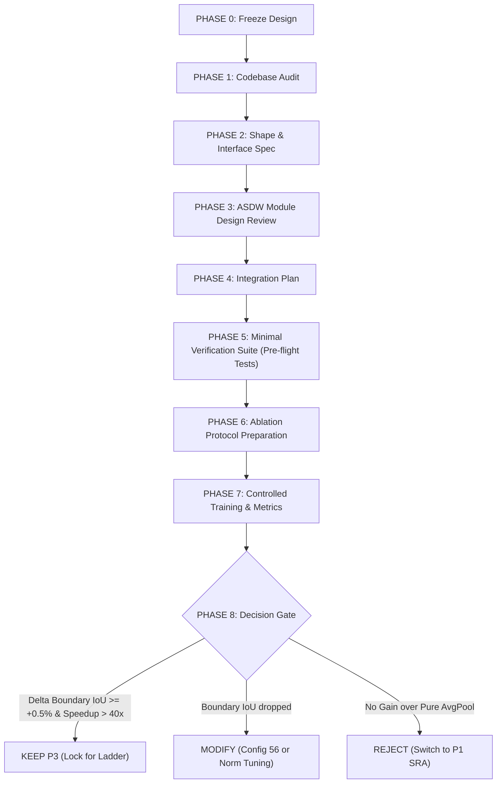

# B2 Experimental Roadmap (SAGE-Lite)

Cập nhật kế hoạch thực nghiệm B2 theo roadmap sau. Mục tiêu là khảo sát có kiểm soát, không mở grid HPO rộng ngay từ đầu.

## Nguyên tắc chung

* Không dùng Test set để chọn hyperparameter.
* Validation là tiêu chí chọn cấu hình.
* Mỗi phase chỉ thay đổi nhóm biến cần khảo sát; các biến còn lại giữ nguyên baseline.
* Không tự ý sửa architecture/pipeline chỉ để cải thiện kết quả.
* Ghi lại đầy đủ config, checkpoint, Val Dice và các routing diagnostics cho từng run để có thể truy nguyên thí nghiệm.

## Phase 0 — Runtime preflight (HOÀN TẤT ✅)

Kết quả đo đạc thực tế trên Tesla T4 (14.56 GB usable, AMP FP16, 448×448, ViT Depth 12):
* **Batch 20 & Batch 14+**: ❌ **OOM** (Vượt ngưỡng VRAM 14.56 GB T4).
* **Batch 12 (Real Crack500 Data)**: ✅ **PASS** (12 training batches thật: Peak Alloc 13.84 GB, Peak Res 14.05 GB, **Free 0.51 GB**, Throughput 0.55 samples/s, 0 memory leak từ batch 2).
* **Batch 12 (Synthetic)**: ✅ **PASS** (12 iters: Peak Alloc 13.77 GB, Peak Res 14.10 GB, Free 0.47 GB, memory drift +0.08 MB).
* **Batch 10 (Synthetic)**: ✅ **PASS** (12 iters: Peak Alloc 13.43 GB, Peak Res 13.89 GB, Free 0.68 GB).
* **Batch 8 (Synthetic)**: ✅ **PASS** (12 iters: Peak Alloc 12.07 GB, Peak Res 12.50 GB, Free 2.07 GB).
* **Targeted Runtime Profiling (SageLayer 0 & 1 Focus, 10 Measured Steps)**: ✅ **PASS**
  - **Phát hiện Căn nguyên 43x Slowdown**: Khi ViT Layer gọi ViT Expert ($N=196$), thời gian chỉ **0.79 ms/call**. Nhưng khi Stage 0 hoặc Stage 1 gọi ViT Expert, chuỗi spatial tokens là **12,544 tokens**, khiến self-attention vọt lên **33.85 – 34.65 ms/call (chậm hơn 43 lần/call)**!
  - **Tập trung Chi phí**: Stage 0 & 1 gọi ViT experts 212 lần trong 10 steps, tiêu tốn 7,255 ms (>85% thời gian expert path của 2 tầng này).
  - **Accounting Reconciliation**: Tổng thời gian vi mô khớp **96.9% – 98.3%** thời gian Expert Path (Compute chiếm 91.8% – 94.5%, residual chỉ 1.7% – 3.1%).
* **ViT Scaling vs Local Window Attention Micro-Benchmark**: ✅ **PASS**
  - **Global ViT $\mathcal{O}(N^2)$**: Tại $N=12,544$ và $B=4$, tổng Fwd+Bwd bùng nổ lên **173.07 ms** (chậm gấp **72.2x** so với $N=196$).
  - **Local Window Attention ($W=7$) $\mathcal{O}(N)$**: Chỉ tốn **24.60 ms** tại $N=12,544$ $\implies$ **nhanh hơn 7.04 lần** so với Global ViT. Chi phí giảm từ $0.003449$ xuống $0.000490$ ms/token.
  - **Ranh giới OOM (Stress Test)**: Nhờ PyTorch SDPA, mô hình chịu tải tới 401,408 tokens ($B=32$, Peak VRAM 3.77 GB) mà không OOM, nhưng arithmetic intensity của Global ViT cao gấp 7.2x.
* **Spatial Compression before Global ViT Feasibility Micro-Benchmark**: ✅ **PASS**
  - **Giảm N qua AdaptiveAvgPool**: Từ $112 \times 112$ ($N=12544$, 177.48 ms ở $B=4$), nén xuống $56 \times 56$ ($N=3136$) tốn **15.84 ms (11.21x nhanh hơn)**; nén xuống $28 \times 28$ ($N=784$) chỉ tốn **3.36 ms (52.90x nhanh hơn)**; nén về $14 \times 14$ ($N=196$) tốn **3.16 ms (56.12x nhanh hơn)**.
  - **Tiết kiệm dự kiến**: Có thể cắt giảm tới 90% thời gian gọi ViT expert ở CNN stages mà vẫn giữ nguyên 100% pretrained weights của ViT-Tiny.
* **Kết luận Runtime Batch Size**: **`batch_size: 12`** và **`num_workers: 2`** chính thức được xác nhận khả thi và an toàn cho Full Training trên dữ liệu Crack500 thật.
* Chi tiết log xem tại: `docs/B2_Phase0_Preflight_Log.md` (Mục 9, 10, 11, 12).

| Hạng mục | Kết quả |
|---|---|
| Real Crack500 pipeline | PASS |
| B2-D12 / top-k=4 | PASS |
| Batch 12 OOM | Không |
| Forward/backward/optimizer | PASS (Đo tách bạch qua CUDA Events) |
| Numerical stability | PASS |
| 16 experts active | PASS (4.7% – 7.2%, 0 dead experts) |
| Peak VRAM (workers=2) | **13,610.5 MB (13.29 GB)** (Headroom ~0.95 GB) |
| Throughput (workers=2) | **2.26 img/s (~13.98 min / epoch)** |
| Có cần sửa architecture? | **Không** |

*Lưu ý:* Việc điều chỉnh batch size từ 20 xuống 12 là **hardware-constrained runtime setting**, không phải HPO/tuning result.

---

## Định Hướng Kiến Trúc Cốt Lõi: Tối Ưu Hóa Nút Thắt High-Resolution CNN→ViT (UPDATE 2026-09-24)

Sau khi đánh giá độc lập điểm nghẽn tính toán của các cuộc gọi CNN Stage 0/1 $\to$ ViT expert ($N=12,544$ và $N=3,136$ tokens), thứ tự ưu tiên và định hướng thực nghiệm chính thức được chốt như sau:

### 1. Thứ Tự Ưu Tiên Triển Khai (Priority Order)
1. **PRIMARY BASELINE $\to$ Proposal 3: Feature/Detail Enhancement $\to$ Spatial Compression**
2. **SECOND $\to$ Proposal 1: Spatial Reduction Attention (SRA)**
3. **THIRD $\to$ Proposal 2: Restricted High-Resolution Routing**

*Động lực định hướng*: Mục tiêu không thuần túy là tốc độ tối đa, mà là sự cân bằng tối ưu tổng thể giữa:
- Độ chính xác phân đoạn vết nứt (Crack segmentation accuracy).
- Khả năng bảo tồn chi tiết và vết nứt siêu mảnh (Thin-crack/detail preservation).
- Ngữ cảnh tầm xa (Long-range context).
- Tính tương thích với ViT-Tiny pretrained ImageNet.
- Triết lý định tuyến đa phương thức dị thể của SAGE (Heterogeneous routing).
- Runtime và VRAM thực tế trên GPU T4.
- Rủi ro kỹ thuật triển khai (Implementation risk).

---

### 2. Chi Tiết Từng Hướng Kiến Trúc

#### PROPOSAL 3 — PRIMARY BASELINE: Feature/Detail Enhancement $\to$ Spatial Compression

##### 1. Thiết Kế Làm Việc Chính Thức (P3 Final Working Design)
* **Quy trình luồng dữ liệu (P3 Pipeline)**:
  $$\text{CNN Stage 0/1 feature} \xrightarrow{} \text{ASDW-Concat Refinement} \xrightarrow{} \text{AdaptiveAvgPool}(28 \times 28) \xrightarrow{} \text{Channel Projection}(192) \xrightarrow{} \text{Pretrained ViT Global Attention} \xrightarrow{} \text{SA-Hub Restore Shape} \xrightarrow{} \text{Residual Fusion}$$
* **Công thức chi tiết ASDW-Concat**:
  $$\begin{aligned}
  H &= \text{DWConv}_{1 \times 7}(X) \quad (\text{groups}=C, \text{padding}=(0, 3)) \\
  V &= \text{DWConv}_{7 \times 1}(X) \quad (\text{groups}=C, \text{padding}=(3, 0)) \\
  L &= \text{DWConv}_{3 \times 3}(X) \quad (\text{groups}=C, \text{padding}=1) \\
  C_{\text{cat}} &= \text{Concat}[H, V, L] \in \mathbb{R}^{B \times 3C \times H \times W} \\
  C_{\text{act}} &= \text{GELU}(C_{\text{cat}}) \\
  F &= \text{PWConv}_{1 \times 1}(C_{\text{act}}) \in \mathbb{R}^{B \times C \times H \times W} \\
  X_{\text{refined}} &= X + \gamma \cdot F \quad (\gamma = 10^{-2}, \text{learnable parameter})
  \end{aligned}$$
* **Mục tiêu nén không gian (Spatial Targets)**:
  - CNN Stage 0: $112 \times 112 \xrightarrow{\text{AdaptiveAvgPool}} 28 \times 28$ ($N=784$ tokens)
  - CNN Stage 1: $56 \times 56 \xrightarrow{\text{AdaptiveAvgPool}} 28 \times 28$ ($N=784$ tokens)
* **Bất biến kiến trúc bắt buộc (Strict Invariants)**:
  1. **Quy tắc hướng kích hoạt**: CHỈ kích hoạt khi $\text{Source} \in \{\text{CNN Stage 0}, \text{CNN Stage 1}\} \land \text{Target} \in \{\text{ViT Experts}\}$.
  2. **Bảo tồn Main CNN Path**: Main path giữ nguyên $100\%$ độ phân giải cao ($112 \times 112$ và $56 \times 56$) và nuôi trực tiếp Skip connections của UNet Decoder.
  3. **Router & Expert Pool bất biến**: Không thay đổi kiến trúc Router, không sửa Heterogeneous Expert Pool.
  4. **Pretrained ViT Black-box**: Giữ nguyên khối ViT-Tiny chuẩn pretrained ImageNet, tuyệt đối không can thiệp nội bộ Self-Attention.
  5. **Không dùng BatchNorm**: Để tránh sụp đổ thống kê khi routing tạo các sub-batches động kích thước nhỏ.
  6. **Không tiền xử lý RGB**: Không dùng Sobel, Laplacian hay can thiệp vào pipeline ảnh đầu vào.
  7. **Tách biệt thực nghiệm**: Không thêm CA, LKA, SoftPool, hay Frequency decomposition ở phase đầu tiên để bảo đảm đo đạc độc lập hiệu ứng của ASDW-Concat.

---

##### 2. Kế Hoạch Triển Khai Tuần Tự (Phase-by-Phase Execution Plan)



###### PHASE 0 — Freeze Design (Khóa Thiết Kế Ban Đầu)
- **ID**: `P3-PHASE-0`
- **Mục tiêu**: Đóng băng toàn bộ thông số toán học, công thức và bất biến của P3; ghi nhận danh sách các giả thuyết chưa được kiểm chứng.
- **Files liên quan**: `docs/B2_Experimental_Roadmap.md`, `docs/SAGE_LITE_NOTES.md`.
- **Việc cần làm**:
  - Khóa công thức ASDW-Concat: $H(1\times 7), V(7\times 1), L(3\times 3) \to \text{Concat} \to \text{GELU} \to \text{PWConv}(1\times 1) \to \text{Residual}(\gamma=10^{-2})$.
  - Khóa spatial target: $112 \times 112 \to 28 \times 28$ và $56 \times 56 \to 28 \times 28$.
  - Ghi nhận các giả thuyết chưa chứng minh: (1) Khả năng pre-emphasis của ASDW cứu được thin-crack sau khi lấy trung bình $4\times 4$; (2) Kernel 7 phù hợp đồng thời cho cả Stage 0 và Stage 1; (3) Concat 3 nhánh không bị redundancy trên background.
- **Input / Output kiểm tra**:
  - Input: Báo cáo audit `p3_asdw_decision_review.md`.
  - Output: Bản đặc tả thiết kế bất biến được ký duyệt trong roadmap.
- **Acceptance Criteria**: Toàn bộ đội ngũ và tài liệu đồng nhất $100\%$ về công thức và các ràng buộc cấm.
- **Verification / Test**: Review chéo tài liệu, kiểm tra không còn mâu thuẫn giữa roadmap và note.
- **Artifact / Log**: `docs/B2_Experimental_Roadmap.md`.
- **Status**: **TODO**

###### PHASE 1 — Codebase Audit & Execution Path Mapping
- **ID**: `P3-PHASE-1`
- **Mục tiêu**: Lập bản đồ luồng thực thi thực tế trong code SAGE-Lite để xác định điểm can thiệp chính xác, không sửa code.
- **Files liên quan**: `sage_lite/sage/components/sage_layer.py`, `sage_lite/sage/components/sa_hub.py`, `sage_lite/sage/networks/convnextv2_vit_hybrid.py`, `sage_lite/sage/networks/b2_unet.py`.
- **Việc cần làm**:
  - Trace luồng tensor tại `SageLayer._execute_expert_path()` khi Stage 0 hoặc Stage 1 được kích hoạt.
  - Kiểm tra interface hiện tại của `SAHub.adapt()`: điểm vào (input adaptation) và điểm ra (output adaptation).
  - Kiểm tra xem ViT block khi nhận 784 tokens ($28 \times 28$) có bị vướng assert `pos_embed` ($N=196$) không.
  - Vẽ Execution Flow Diagram chi tiết từ lúc tensor rời Stage 0 đến khi quay lại residual fusion của `SageLayer`.
- **Input / Output kiểm tra**:
  - Input: Mã nguồn hiện tại của `SageLayer` và `SAHub`.
  - Output: Diagram và danh sách dòng code chính xác nơi tensor được trích xuất và biến đổi.
- **Acceptance Criteria**: Xác định được điểm chèn module mà $100\%$ không chạm vào `main_output` và không ảnh hưởng các cặp routing khác.
- **Verification / Test**: Static inspection bằng công cụ đọc mã nguồn (`view_file`, `grep_search`).
- **Artifact / Log**: Section "P3 Execution Path Trace" trong `docs/SAGE_LITE_NOTES.md`.
- **Status**: **TODO**

###### PHASE 2 — Interface & Tensor Shape Specification
- **ID**: `P3-PHASE-2`
- **Mục tiêu**: Thiết lập bảng đặc tả hình dạng tensor (Shape Contract) tại mọi trạm trung chuyển trong pipeline P3.
- **Files liên quan**: `sage_lite/sage/components/sa_hub.py`.
- **Việc cần làm**:
  - Lập bảng đặc tả shape chi tiết cho Stage 0 và Stage 1 qua 7 bước:
    1. Input tensor: S0 $(B, 48, 112, 112)$ | S1 $(B, 96, 56, 56)$
    2. ASDW Output: S0 $(B, 48, 112, 112)$ | S1 $(B, 96, 56, 56)$
    3. Compressed: S0 $(B, 48, 28, 28)$ | S1 $(B, 96, 28, 28)$
    4. Channel Projected: $(B, 192, 28, 28)$
    5. ViT Input Sequence: $(B, 784, 192)$ (với $N=784$ tokens)
    6. ViT Output Sequence: $(B, 784, 192)$
    7. SA-Hub Restored Shape: S0 $(B, 48, 112, 112)$ | S1 $(B, 96, 56, 56)$
- **Input / Output kiểm tra**:
  - Input: Contract kích thước kênh ConvNeXt Femto $[48, 96, 192, 384]$ và ViT embed dim $192$.
  - Output: Bảng Shape Contract hoàn chỉnh không có chiều nào bị mơ hồ.
- **Acceptance Criteria**: Tất cả các bước chuyển đổi phải khớp về mặt toán học; phép chiếu ngược tại SA-Hub phải khôi phục chính xác kích thước gốc của Stage.
- **Verification / Test**: Dry-run tensor shape calculation trên giấy / doc.
- **Artifact / Log**: Bảng Shape Contract trong tài liệu kỹ thuật.
- **Status**: **TODO**

###### PHASE 3 — ASDW Module Design & Complexity Review
- **ID**: `P3-PHASE-3`
- **Mục tiêu**: Rà soát tham số, FLOPs, padding, cơ chế khởi tạo và cấu trúc lớp của module ASDW trước khi viết mã nguồn.
- **Files liên quan**: `sage_lite/sage/networks/` (dự kiến tạo submodule hoặc component riêng).
- **Việc cần làm**:
  - Xác nhận chính xác số lượng tham số:
    + Stage 0 ($C=48$): DW1x7 (336) + DW7x1 (336) + DW3x3 (432) + PW1x1 ($144 \times 48 = 6,912$) + $\gamma$ (1) = **8,017 params**.
    + Stage 1 ($C=96$): DW1x7 (672) + DW7x1 (672) + DW3x3 (864) + PW1x1 ($288 \times 96 = 27,648$) + $\gamma$ (1) = **29,857 params**.
    + Tổng cả 2 stage: **37,874 params** ($\approx 0.27\%$ mô hình).
  - Xác nhận padding: `padding=(0, 3)` cho 1x7; `padding=(3, 0)` cho 7x1; `padding=1` cho 3x3 để bảo toàn kích thước $H \times W$.
  - Xác nhận khởi tạo: $\gamma$ khởi tạo tensor `torch.tensor(0.01)`.
  - Quyết định nơi khởi tạo module (trong `SAHub` hay wrap ngoài `ViTExpert`).
- **Input / Output kiểm tra**:
  - Input: Báo cáo FLOPs và tham số.
  - Output: Bản thiết kế class `nn.Module` chi tiết về mặt chữ ký hàm (signature).
- **Acceptance Criteria**: Sai số tham số tính toán bằng 0; không có layer nào bị thiếu padding gây co rút biên feature map.
- **Verification / Test**: Script tính toán độc lập số tham số lý thuyết.
- **Artifact / Log**: Báo cáo kiểm định tham số trong nhật ký.
- **Status**: **TODO**

###### PHASE 4 — Integration Architecture Plan
- **ID**: `P3-PHASE-4`
- **Mục tiêu**: Xây dựng phương án tích hợp module vào mạng lưới SAGE mà không làm phá vỡ các hợp đồng hệ thống.
- **Files liên quan**: `sage_lite/sage/components/sage_layer.py`, `sage_lite/sage/components/sa_hub.py`.
- **Việc cần làm**:
  - Thiết kế điều kiện rẽ nhánh (Guard Condition):
    ```python
    if is_source_cnn_s0_or_s1 and is_target_vit_expert:
        x_enhanced = self.asdw_refinement(x_sub)
        x_compressed = F.adaptive_avg_pool2d(x_enhanced, (28, 28))
        # chuyển tiếp vào SA-Hub / ViT
    ```
  - Đảm bảo cơ chế Bypass (`my_index == expert_idx`) hoạt động bình thường khi Stage 0 tự chọn chính nó.
  - Bảo đảm các nhánh `ViT -> CNN S0/S1` và `CNN -> CNN` tuyệt đối không đi qua khối nén.
  - Lên phương án tương thích checkpoint: module mới có tham số nên cần quản lý tên biến trong `state_dict` rõ ràng.
- **Input / Output kiểm tra**:
  - Input: Luồng gọi hàm của `SageLayer`.
  - Output: Bản thiết kế logic điều kiện tích hợp.
- **Acceptance Criteria**: Điều kiện kích hoạt là chặt chẽ, không có ngõ ngách rò rỉ làm ảnh hưởng đến các routing khác.
- **Verification / Test**: Code review mô phỏng trên sơ đồ logic.
- **Artifact / Log**: Kế hoạch tích hợp chi tiết.
- **Status**: **TODO**

###### PHASE 5 — Minimal Verification Suite (Pre-flight Test Protocols)
- **ID**: `P3-PHASE-5`
- **Mục tiêu**: Soạn thảo bộ 9 bài kiểm thử đơn vị và tích hợp (Unit & Integration Tests) bắt buộc phải PASS trước khi tiến hành huấn luyện.
- **Files liên quan**: `sage_lite/scripts/tests/` (tạo kịch bản test mới `test_p3_invariants.py`).
- **Danh mục 9 bài test bắt buộc**:
  1. *Shape Preservation Test*: Kiểm tra output shape sau toàn bộ chu trình nén - giải nén phải khớp chính xác $(B, C, 112, 112)$ và $(B, C, 56, 56)$.
  2. *Identity / Residual Scale Test*: Với $\gamma = 0$, output của module phải bằng input $X$ với sai số tuyệt đối $< 10^{-7}$.
  3. *Condition Trigger Test*: Xác nhận module CHỈ kích hoạt khi cặp $(source, target)$ là $(\text{CNN S0/S1}, \text{ViT})$.
  4. *Non-target Path Invariance Test*: Xác nhận kết quả của `ViT -> CNN` và `CNN -> CNN` hoàn toàn giống hệt baseline gốc.
  5. *Main Path Bitwise Invariance*: Xác nhận `main_output` không bị trỏ nhầm hay sửa đổi sau khi thêm P3.
  6. *Parameter Count Verification*: Đo trực tiếp `numel()` của module khớp chính xác 8,017 và 29,857 params.
  7. *AMP FP16 Stability Test*: Chạy forward + backward dưới `torch.cuda.amp.autocast()` không sinh ra `NaN` hay `Inf`.
  8. *Sub-batch Dynamics Test*: Chạy với batch size $B=1$ (trường hợp router chỉ gửi 1 mẫu cho expert) để bảo đảm không lỗi dimension hay normalization.
  9. *Latency Microbenchmark*: Đo thời gian thực tế của bước refinement + compression trên T4, bảo đảm $< 0.3\text{ ms}$.
- **Input / Output kiểm tra**:
  - Input: Kịch bản test định nghĩa sẵn.
  - Output: Log thực thi của test runner báo cáo 9/9 PASS.
- **Acceptance Criteria**: Tất cả 9 test cases đều đạt $100\%$ PASS.
- **Verification / Test**: Thực thi script test trên GPU T4.
- **Artifact / Log**: `results/preflight/P3_verification_log.md`.
- **Status**: **TODO**

###### PHASE 6 — Ablation Protocol Preparation
- **ID**: `P3-PHASE-6`
- **Mục tiêu**: Chuẩn bị bộ 3 cấu hình thử nghiệm đối chứng có kiểm soát chặt chẽ để cô lập hiệu ứng của ASDW-Concat.
- **Files liên quan**: `sage_lite/configs/p3_ablation/`.
- **Bộ 3 cấu hình đối chứng**:
  * **Run A (Control - Pure Compression)**: $\text{AvgPool}(28 \times 28) \to \text{ViT}$ (Không có refinement). Đo tổn thất thông tin thuần túy do nén $16\times$.
  * **Run B (Generic Refinement)**: $\text{DW-PW } 3\times 3 \to \text{AvgPool}(28 \times 28) \to \text{ViT}$. Đo hiệu ứng tăng dung lượng đặc trưng thông thường.
  * **Run C (Full P3 - Anisotropic Refinement)**: $\text{ASDW-Concat } (1\times 7 + 7\times 1 + 3\times 3) \to \text{AvgPool}(28 \times 28) \to \text{ViT}$. Đo hiệu ứng của inductive bias định hướng.
- **Điều kiện đẳng cấu (Strict Invariance Controls)**:
  - Cùng chung ViT depth (Depth 6 hoặc Depth 12 cố định).
  - Cùng chung seed ($42$), data split Crack500 chuẩn, optimizer, learning rate, scheduler.
  - Cùng chung batch size ($12$) và số epoch ($30$).
- **Input / Output kiểm tra**:
  - Input: 3 file cấu hình yaml chuẩn hóa.
  - Output: Bảng so sánh tham số giữa 3 cấu hình xác nhận chỉ lệch nhau ở khối refinement.
- **Acceptance Criteria**: $100\%$ các siêu tham số ngoài khối refinement phải đồng nhất.
- **Verification / Test**: Diff kiểm tra giữa 3 file cấu hình.
- **Artifact / Log**: `configs/b2_p3_run_a.yaml`, `configs/b2_p3_run_b.yaml`, `configs/b2_p3_run_c.yaml`.
- **Status**: **TODO**

###### PHASE 7 — Controlled Training & Metrics Collection
- **ID**: `P3-PHASE-7`
- **Mục tiêu**: Thực thi huấn luyện và thu thập đầy đủ bộ chỉ số đánh giá chuyên sâu cho phân đoạn vết nứt.
- **Files liên quan**: `sage_lite/scripts/train_crack.py`, `sage_lite/sage/utils/advanced_metrics.py`.
- **Bộ chỉ số đo lường tối thiểu**:
  1. *Foreground Dice & IoU* (Đo độ chính xác vùng diện tích).
  2. *Boundary IoU* (Đo độ sắc nét và bảo tồn biên của vết nứt mảnh).
  3. *Hausdorff Distance 95 (HD95)* (Đo khoảng cách sai lệch tối đa của đường biên vết nứt).
  4. *Average Precision (AP)* và *F1-score*.
  5. *Epoch Time & Throughput (samples/s)*.
  6. *Peak Allocated & Reserved VRAM*.
  7. *Router Selection Entropy & Expert Utilization* (Kiểm tra phân phối định tuyến).
- **Input / Output kiểm tra**:
  - Input: Dữ liệu Crack500 đã tiền xử lý canonical.
  - Output: Checkpoints tốt nhất (`best_val_dice.pth`) và file log JSONL/MD chứa toàn bộ kết quả.
- **Acceptance Criteria**: Huấn luyện hoàn thành trọn vẹn 30 epochs không bị gián đoạn hay phát sinh lỗi số học; log ghi nhận đầy đủ chỉ số.
- **Verification / Test**: Chạy validation chính thức trên test set của Crack500.
- **Artifact / Log**: `results/experiments/P3_Crack500_Ablation_Results.md`.
- **Status**: **TODO**

###### PHASE 8 — Decision Gate (Thẩm Định & Quyết Định Cuối Cùng)
- **ID**: `P3-PHASE-8`
- **Mục tiêu**: Dựa trên bằng chứng thực nghiệm thu thập từ Phase 7 để đưa ra phán quyết kiến trúc chính thức cho SAGE-Lite.
- **Files liên quan**: `docs/B2_Experimental_Roadmap.md`, `milestone_and_progress.md`.
- **Quy tắc phán quyết (Decision Logic)**:
  * **KỊCH BẢN 1: KEEP P3 (Chấp thuận chính thức)**
    - *Điều kiện*: $\text{Run C} - \text{Run A} \ge +0.5\%$ Boundary IoU VÀ Run C giữ được ít nhất $98\%$ Foreground Dice so với Direct Baseline (không nén) VÀ Throughput đạt $> 2.0\text{ samples/s}$ ($>40\times$ speedup trên expert path).
    - *Hành động*: Khóa P3 làm kiến trúc mặc định cho B2 trên toàn bộ các Milestone tiếp theo.
  * **KỊCH BẢN 2: MODIFY P3 (Sửa đổi & Tinh chỉnh)**
    - *Điều kiện*: Run C vượt trội hơn Run A về Boundary IoU nhưng tổng thể Foreground Dice bị sụt giảm quá $1.5\%$ so với Direct Baseline DO nén quá mức về $28 \times 28$.
    - *Hành động*: Chuyển sang khảo sát **Config 56** ($112 \to 56$ cho S0, $56 \to 28$ cho S1) hoặc bổ sung normalization nhẹ (`GroupNorm(3, 3C)`).
  * **KỊCH BẢN 3: REJECT P3 (Bác bỏ)**
    - *Điều kiện*: $\text{Run C} \approx \text{Run B} \approx \text{Run A}$ (sai khác $< 0.1\%$ Boundary IoU) $\implies$ Khối refinement không có tác dụng cứu vãn thông tin trước phép nén; HOẶC Run C sinh ra quá nhiều false positives trên sỏi đá bê tông làm HD95 tăng vọt.
    - *Hành động*: Hủy bỏ nhánh P3; chính thức kích hoạt **Proposal 1 (SRA)** làm hướng ưu tiên số 1.
- **Input / Output kiểm tra**:
  - Input: Bảng số liệu tổng hợp từ Phase 7.
  - Output: Biên bản phán quyết kiến trúc được phê duyệt.
- **Acceptance Criteria**: Quyết định được đưa ra thuần túy dựa trên số liệu thực nghiệm định lượng, không dựa trên cảm tính.
- **Verification / Test**: Kiểm tra chéo số liệu giữa log training và kết quả eval chính thức.
- **Artifact / Log**: Cập nhật kết luận chính thức vào `milestone_and_progress.md`.
- **Status**: **TODO**

---

##### 3. Bảng Kiểm Tra Tiến Độ (Phase Checklist)
- [ ] `P3-PHASE-0`: Freeze Design & Invariants Documentation
- [ ] `P3-PHASE-1`: Codebase Audit & Execution Path Mapping (No Code Changes)
- [ ] `P3-PHASE-2`: Tensor Shape Contract Specification
- [ ] `P3-PHASE-3`: ASDW Module Signature & Complexity Audit
- [ ] `P3-PHASE-4`: Integration Guard Logic & Checkpoint Plan
- [ ] `P3-PHASE-5`: Minimal 9-Test Verification Suite Execution
- [ ] `P3-PHASE-6`: 3-Run Ablation Protocol Configuration
- [ ] `P3-PHASE-7`: Controlled Training & Metrics Benchmarking
- [ ] `P3-PHASE-8`: Architectural Decision Gate Verdict

---

##### 4. Danh Sách Rủi Ro & Giả Thuyết Cần Theo Dõi (Risk & Assumption Registry)
1. **Giả thuyết Pre-emphasis**: Giả định rằng việc khuếch đại cục bộ bằng ASDW có thể chống lại hiệu ứng pha loãng $16\times$ của AvgPool trên cửa sổ $4 \times 4$. *Theo dõi qua*: So sánh Boundary IoU Run C vs Run A.
2. **Rủi ro Khuếch đại Nhiễu Nền (Gravel Noise)**: Kernel $1 \times 7$ và $7 \times 1$ có thể phản ứng với các rãnh sỏi đá thẳng, tạo false positives. *Theo dõi qua*: Chỉ số HD95 và trực quan hóa feature maps.
3. **Hiện tượng Linear / Redundancy trong Concat**: 3 nhánh có thể phản hồi tương đồng trên vùng nền phẳng, gây lãng phí tham số của lớp $1 \times 1$. *Theo dõi qua*: Phân tích trọng số của lớp PWConv $1 \times 1$.
4. **Giới hạn Nén $28 \times 28$**: Vết nứt mảnh $1$-pixel có thể bị xóa sổ hoàn toàn nếu độ tương phản ban đầu quá thấp, vượt quá khả năng cứu vãn của bất kỳ bộ lọc trước nén nào. *Theo dõi qua*: Kịch bản chuyển hướng sang Config 56 tại Decision Gate.

---

##### 5. Danh Sách CÁC ĐIỀU CẤM TUYỆT ĐỐI (Strict Negative Invariants)
- ❌ **CẤM** viết code module hay sửa bất kỳ file `.py` nào trong Phase lập kế hoạch này.
- ❌ **CẤM** sửa `main_block` hay can thiệp vào đường truyền $112 \times 112$ của Main CNN Path.
- ❌ **CẤM** sửa khối `ViT-Tiny` hay viết lại cơ chế Attention nội bộ của timm ViT block.
- ❌ **CẤM** kích hoạt module nén/refinement trên hướng ngược lại (`ViT -> CNN S0/S1`) hoặc các hướng CNN$\to$CNN.
- ❌ **CẤM** sử dụng `BatchNorm2d` bên trong module refinement.
- ❌ **CẤM** dùng các bộ lọc tiền xử lý cố định (Sobel/Laplacian) trên ảnh RGB.
- ❌ **CẤM** đánh dấu hoàn tất (DONE) bất kỳ Phase nào nếu chưa chạy kiểm thử và chưa có file log minh chứng thực tế.

#### PROPOSAL 1 — SECOND PRIORITY: SRA (Spatial Reduction Attention)
* **Cơ chế**:
  - $Q$ giữ nguyên full spatial resolution ($112 \times 112 = 12,544$ tại Stage 0; $56 \times 56 = 3,136$ tại Stage 1).
  - $K, V$ được nén không gian (ví dụ $28 \times 28 = 784$ tại Stage 0).
  - Attention duy trì cơ chế toàn cục trên tập K/V nén.
* **Động lực chính**: Giữ lưới tọa độ Query/Output độ phân giải cao, giữ receptive field toàn cục, giảm chi phí ma trận $\mathcal{O}(N^2)$.
* **Lưu ý triển khai**: Cần can thiệp vào attention bên trong ViT block, tái sử dụng pretrained Q/K/V projections. Đặc biệt, khối ViT là module dùng chung (*shared expert*), vừa làm Bottleneck ($N=196$), vừa làm expert cho Stage 0/1 ($N=12,544$), do đó cần thiết kế API/cấu trúc an toàn để hỗ trợ cả hai chế độ mà không làm gãy vỡ đường truyền Bottleneck.
* **Vị trí**: Xếp thứ hai trong lộ trình, không phải mục tiêu triển khai ngay lập tức.

#### PROPOSAL 2 — THIRD PRIORITY: Restricted High-Resolution Routing
* **Quy tắc định tuyến**:
  - Stage 0 & Stage 1: Chỉ được chọn CNN experts (Indices 0..3).
  - Stage 2 & Stage 3: Giữ full CNN + ViT expert pool (16 experts).
  - Tất cả các tầng ViT (Layers 4..15): Giữ full 16 experts.
* **Lưu ý bắt buộc**:
  - Không sửa expert pool.
  - Không nén không gian, không sửa ViT block.
* **Điểm nghẽn cốt tử cần giải quyết trước khi code**: Cấu hình hiện tại là `top_k = 4` trong khi số CNN experts chỉ có 4. Nếu chỉ mask ViT logits, router bị buộc phải chọn tất cả 4 CNN experts cho mọi mẫu $\to$ mất hoàn toàn tính chọn lọc và đa dạng định tuyến. Phải có giải pháp cấu hình (ví dụ Dynamic `top_k = 2` cho Stage 0/1) và tài liệu hóa rõ ràng rằng điều này đưa vào một biến thực nghiệm bổ sung.

---

### 3. Các Nguyên Tắc Kiến Trúc Quan Trọng (Important Architectural Principles)
1. **Không coi 3 proposal là các mẹo vặt thay thế lẫn nhau**: Chúng trả lời 3 câu hỏi nghiên cứu độc lập:
   - *P3*: "Liệu ta có thể bảo tồn ngữ cảnh toàn cục đa phương thức trong khi nén biểu diễn của expert không?"
   - *P1*: "Liệu ta có thể giữ Query độ phân giải cao + ngữ cảnh toàn cục trong khi giảm chi phí attention của K/V không?"
   - *P2*: "Liệu ta có thực sự cần định tuyến CNN $\to$ ViT ở độ phân giải cao hay không?"
2. **Main CNN Path bắt buộc phải là nguồn gốc của chi tiết vết nứt độ phân giải cao**: Nhánh expert không thay thế main path.
3. **Không được mặc định rằng attention trên chuỗi lớn ($N=12,544$) sẽ tự động trở nên uniform**: Đây chưa phải là sự thật được xác lập trong hệ thống và không được dùng làm giả định thiết kế.
4. **Các kích thước không gian đã xác thực**:
   - Stage 0 = $112 \times 112 = 12,544$ tokens
   - Stage 1 = $56 \times 56 = 3,136$ tokens
   - Stage 2 = $28 \times 28 = 784$ tokens
   - Stage 3 / ViT bottleneck = $14 \times 14 = 196$ tokens
5. **Phân biệt rõ 4 loại tổn thất riêng biệt**:
   - Mất độ phân giải không gian (Loss of spatial resolution).
   - Mất ngữ cảnh toàn cục (Loss of global context).
   - Mất tương tác đa phương thức (Loss of cross-modal interaction).
   - Mất mát/nhòe do nội suy (Loss caused by interpolation).
6. **Các ước tính runtime từ microbenchmark chỉ là ước lượng**: Tuyệt đối không trình bày các phép ngoại suy tốc độ epoch như là hiệu năng end-to-end được đảm bảo chắc chắn.

---

### 3.1 Quy Tắc Hướng Định Tuyến Bất Biến Cốt Lõi (Core Routing Direction Invariant)
> ⚠️ **BẤT BIẾN KIẾN TRÚC BẮT BUỘC CHO CẢ 3 PROPOSALS:**
> Bất kỳ xử lý đặc biệt nào cho nhánh CNN high-resolution $\to$ ViT **CHỈ ĐƯỢC PHÉP KÍCH HOẠT KHI THỎA MÃN ĐỒNG THỜI CẢ 2 ĐIỀU KIỆN**:
> 1. **Tầng nguồn (Source SageLayer)** là CNN Stage 0 HOẶC CNN Stage 1 (`source ∈ {CNN Stage 0, CNN Stage 1}`).
> 2. **Chuyên gia đích được chọn (Selected Expert)** là một khối Transformer / ViT (`target ∈ {ViT Experts}`).
> 
> Biểu diễn toán tử logic:
> $$\mathbf{Trigger} \iff (\text{source} \in \{\text{CNN Stage 0}, \text{CNN Stage 1}\}) \land (\text{target} \in \{\text{ViT Experts}\})$$

* **TẤT CẢ CÁC HƯỚNG ĐỊNH TUYẾN CÒN LẠI BẮT BUỘC PHẢI GIỮ NGUYÊN HÀNH VI SAGE CHUẨN (Normal SAGE)**:
  - `CNN S0 → CNN expert` $\implies$ Normal SAGE.
  - `CNN S1 → CNN expert` $\implies$ Normal SAGE.
  - `CNN S2 → CNN expert` $\implies$ Normal SAGE.
  - `CNN S2 → ViT expert` $\implies$ Normal SAGE (trừ khi có proposal tương lai yêu cầu rõ ràng).
  - `CNN S3 → ViT expert` $\implies$ Normal SAGE (trừ khi có proposal tương lai yêu cầu rõ ràng).
  - `ViT → CNN S0/S1` $\implies$ **Normal SAGE 100%**.
  - `ViT → CNN S2/S3` $\implies$ Normal SAGE.
  - `ViT → ViT` $\implies$ Normal SAGE.

* **TẠI SAO ĐIỀU NÀY MANG TÍNH SINH TỬ**:
  - Điểm nghẽn bùng nổ tính toán xuất phát từ: `Feature CNN phân giải cao (112x112 / 56x56) → Chuyển sang dạng Transformer (12,544 tokens) → ViT Global Attention trên số tokens khổng lồ`.
  - Hướng ngược lại: `ViT → CNN Stage 0/1` xuất phát từ biểu diễn ViT phân giải thấp ($N=196$ tại bottleneck), nên **KHÔNG HỀ GÂY RA** điểm nghẽn attention độ phân giải cao!
  - **TUYỆT ĐỐI KHÔNG ÁP DỤNG ĐỐI XỨNG CƠ CHẾ NÉN/SRA CHO CẢ 2 CHIỀU.**
  - **Phân biệt rõ**: "Source CNN Stage 0/1" và "Target CNN Stage 0/1 Expert" là hai khái niệm hoàn toàn khác biệt. Khi một tầng ViT gọi chuyên gia Stage 0, Stage 0 là TARGET, không phải SOURCE. Không được kích hoạt cơ chế nén!

* **Áp dụng cụ thể cho từng Proposal**:
  - **P3 (Enhance + Compress)**: CHỈ nhánh `CNN S0/S1 → ViT` mới qua Detail Refinement + Spatial Compression. Main path, Router, Expert pool, ViT$\to$CNN, CNN$\to$CNN, S2/S3$\to$ViT giữ nguyên gốc. Tuyệt đối không nén toàn cục feature của Stage 0/1.
  - **P1 (SRA)**: CHỈ kích hoạt SRA khi ViT expert nhận tensor từ CNN S0/S1. Khi ViT block chạy ở bottleneck ($N=196$) hoặc được gọi bởi S2/S3, chạy standard attention chuẩn.
  - **P2 (Restricted Routing)**: CHỈ giới hạn quyền chọn của S0/S1 (`S0/S1 → CNN experts only`). Chiều ngược lại `ViT → CNN S0/S1` vẫn được phép 100% và chạy normal SAGE.

* **Yêu cầu triển khai (Implementation Requirement)**:
  - Bắt buộc kiểm tra tường minh theo cặp (Source, Target):
    ```python
    if source_is_cnn_stage_0_or_1 and target_is_transformer_expert:
        # Áp dụng cơ chế high-res CNN->ViT đặc thù của proposal
    else:
        # Chạy normal SAGE path
    ```
  - CẤM TUYỆT ĐỐI dựa vào: số chiều tensor đơn thuần, số lượng channels đơn thuần, chỉ số expert đơn thuần, hay logic generic kiểu `if transformer` hoặc `if Stage 0/1`.

---

### 4. Lộ Trình Thực Nghiệm Hiện Tại (Current Roadmap)
$$\text{B2 Current Baseline (Two-Stage Phase 1)} \implies \text{P3: Enhancement} \to \text{Spatial Compression} \implies \text{P1: SRA} \implies \text{P2: Restricted S0/S1 Routing}$$

---

## Phase 1 — Khảo sát ViT depth (Baseline Scale) (ĐÃ SẴN SÀNG CẤU HÌNH ✅)

Do thay depth ảnh hưởng đến architecture và routing scale, Phase 1 chạy đầu tiên để lock base architecture.

* **Cố định dùng chung**:
  - `batch_size = 12` (runtime setting đã xác thực qua Real-Data Preflight trên T4)
  - `img_size = 448`, `seed = 42`, `lr = 1e-4`, `epochs = 30`, `patience = 6`
  - Canonical preprocessing (Crack500 random crop 448x448, smart filter `fg_pixels >= 20`, reflect pad)
  - SAGE config: `top_k = 4`, `hidden = 64`, `gating = sigmoid`, `noise = ON`, `logit_mod = ON`, `LB = 0.01`, `dropout = 0.1`, `fusion_type = residual`, `residual_scale = 0.1`.
* **Bộ cấu hình thực nghiệm Phase 1**:
  * **Run 1: Depth 12** (`configs/b2_crack500_depth12.yaml` → `output_dir: .../B2_Crack500_Depth12`): 16 routers (4 CNN + 12 ViT), 16 experts, 13.9M params.
  * **Run 2: Depth 6** (`configs/b2_crack500_depth6.yaml` → `output_dir: .../B2_Crack500_Depth6`): 10 routers (4 CNN + 6 ViT), 10 experts, 12.0M params.
  * **Run 3: Depth 4** (`configs/b2_crack500_depth4.yaml` → `output_dir: .../B2_Crack500_Depth4`): 8 routers (4 CNN + 4 ViT), 8 experts, 10.1M params.
* **Quy tắc Quyết định**: Chọn 1 depth tốt nhất **dựa duy nhất trên Validation Dice (tập Val)** để làm base cho Phase 2 (top_k). **TUYỆT ĐỐI KHÔNG DÙNG TEST SET ĐỂ CHỌN DEPTH**.


## Phase 2 — Khảo sát Routing Capacity (top_k)

* Fix: Base depth từ Phase 1.
* Thử nghiệm (thay đổi top_k):
  * Run 4: top_k = 2
  * Run 5: top_k = 4 (đã chạy ở Phase 1)
* Decision: Chọn top_k tốt nhất. (Nếu top_k=2 gần bằng top_k=4, ưu tiên top_k=2 vì FLOPS thấp hơn).

## Phase 3 — Khảo sát Router Hidden Dim

* Fix: Base depth (P1) + Best top_k (P2).
* Thử nghiệm:
  * Run 6: router_hidden_dim = 32
  * Run 7: router_hidden_dim = 64 (từ P1)
  * Run 8: router_hidden_dim = 128
* Decision: Chọn hidden_dim.

## Phase 4 — Cân bằng tải (Load Balancing)

Chỉ mở phase này nếu log cho thấy expert bị "dead" hoặc mất cân bằng nghiêm trọng. Chú ý: LB loss scale theo số lượng routers, nên Depth 12 vs Depth 6 sẽ có total LB loss khác nhau. Phải soi trung bình LB/router.

* Fix: Base config từ P3.
* Thử nghiệm (LB weight):
  * Run 9: LB = 0.005
  * Run 10: LB = 0.01 (từ P1)
  * Run 11: LB = 0.03

## Phase 5 — Optimization Stability (SAGE LR & Warmup)

Nhóm parameters của SAGE (Routers + Adapters) thường cần LR khác backbone.
Mặc định hiện tại: Backbone=1e-5, Decoder=1e-4.

* Thử nghiệm (SAGE LR):
  * Run 12: SAGE LR = 5e-5
  * Run 13: SAGE LR = 1e-4
  * Run 14: SAGE LR = 2e-4
* Thử nghiệm Warmup epochs (nếu thấy training bị spike loss đầu epoch):
  * Run 15: Warmup = 2
  * Run 16: Warmup = 3
  * Run 17: Warmup = 5

## Phase 6 — Regularization (Nghiên cứu thêm)

* Thử nghiệm dropout cho adapter:
  * expert_dropout = {0.0, 0.1, 0.2}
* Thử nghiệm pure residual scale:
  * residual_scale = {0.05, 0.1, 0.2}

Quy trình: Đưa cho tôi script preflight và file kế hoạch này. Khi nào chuẩn bị xong Colab tôi sẽ chạy Phase 0 và gửi log.

## Phase A — Khảo sát Residual Scale
* Fix: fusion_type = "residual"
* Cố định các biến khác (dropout=0.1, top_k, depth, router, v.v.)
* Thử nghiệm residual_scale:
  * Run A1: residual_scale = 0.05
  * Run A2: residual_scale = 0.10 (Baseline từ trước)
  * Run A3: residual_scale = 0.20
* Decision: Chọn residual_scale tốt nhất trên Validation.

## Phase B — So sánh Fusion Type (Residual vs Adaptive)
* Fix: Chọn residual_scale tốt nhất từ Phase A cho Residual variant.
* Adaptive Fusion variant: Sử dụng `alpha` (learnable scalar).
* Đảm bảo cách ly (isolation): giữ nguyên cùng ViT depth, expert pool, top_k, router hidden, LB factor, learning rate, preprocessing, random seed, v.v.
* Thử nghiệm so sánh:
  * Run B1: Residual Fusion (với scale tốt nhất Phase A)
  * Run B2: Original SAGE Adaptive Fusion (với learnable alpha)
* Decision: Chọn Fusion mechanism.
