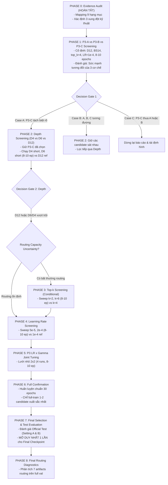

# Crack500 Experimental Protocol & Evidence-Based Execution Roadmap

*Date: 2026-09-26*  
*Hardware Target: Tesla T4 (Google Colab, 14.56 GB usable VRAM)*  
*Canonical Reference Checkpoint: `P3_C_Routing_Diagnostics/checkpoints/best_model_b2_global.pth`*  
*Reference SHA256: `866d1d833dc032e9563368c5a8d3dd980120968eb9e067eab251b4c561fc52b9`*  
*Reference Performance: Best Val Dice = `0.7557` (Stage 2 Epoch 9)*  
*Parent Roadmap Document: [`docs/B2_Experimental_Roadmap.md`](file:///d:/truong/SpecialSubjectTTNT/docs/B2_Experimental_Roadmap.md)*  

---

## 0. Mục Tiêu Và Nguyên Tắc Cốt Lõi (Core Principles & Objectives)

Mục tiêu tối thượng của lộ trình này là thiết lập và thực thi một giao thức thực nghiệm chặt chẽ, có căn cứ khoa học vững chắc để chọn lựa kiến trúc và cấu hình cuối cùng cho mạng SAGE-Lite trên tập dữ liệu Crack500, đồng thời kiểm soát nghiêm ngặt ngân sách tính toán (compute budget) và triệt để tránh bùng nổ tổ hợp (full-grid combinatorial explosion).

### 8 Nguyên Tắc Bắt Buộc (Strict Invariants)
1. **Không thay đổi kiến trúc/giao thức chuẩn**: Không sửa đổi kiến trúc canonical và protocol ngoài các biến sweep được đăng ký chính thức.
2. **Short screening không phải phán quyết cuối cùng**: Kết quả short screening (8–10 epochs) chỉ đóng vai trò lọc ứng viên phân kỳ/kém hiệu quả, không được dùng để tuyên bố cấu hình "tối ưu".
3. **Tuyệt đối cấm Full-Grid**: Không chạy lưới toàn phần $3 \text{ Modes} \times 3 \text{ Depths} \times 3 \text{ Top-k} \times 3 \text{ LRs} \times 3 \text{ Gammas}$ ($243$ runs).
4. **Bảo toàn tính so sánh ngang hàng (Apples-to-Apples)**: Mọi phép so sánh quan trọng phải giữ nguyên toàn bộ pipeline (dataset split, preprocessing `img_size=448`, seed=42, optimizer tier, batch size).
5. **Minh bạch hóa phân loại lượt chạy**: Mọi lượt chạy phải được phân loại rõ ràng thành: (1) *Existing Reference*, (2) *Short Screening*, hoặc (3) *Full Confirmation*.
6. **Không tuyên bố vô căn cứ**: Tuyệt đối không gọi một cấu hình là "optimal" hay "superior" khi chưa có bằng chứng thực nghiệm đầy đủ tương ứng.
7. **Không retrain thừa thãi**: Không tự ý huấn luyện lại mô hình Canonical P3-C (Val Dice 0.7557) khi không có lý do kỹ thuật bắt buộc.
8. **Quy ước Reference Point**: Checkpoint `P3-C / D12 / top-k=4 / LR=1e-4` (Val Dice = 0.7557) được giữ làm mốc tham chiếu chuẩn (*reference point*), nhưng **KHÔNG ĐƯỢC COI** đây là bằng chứng cho thấy D12 hoặc P3-C đã được chứng minh là tối ưu toàn cục.

---

## 1. PHASE 0 — Thẩm Định Bằng Chứng Hiện Có (Evidence Audit)

### 1.1. Thẩm định ViT Depth (D4, D6, D12)
* **Depth 4 (D4)**:
  - Tệp kết quả [`results/B1_Crack500_Depth4_Results.md`](file:///d:/truong/SpecialSubjectTTNT/SAGE_LITE/results/B1_Crack500_Depth4_Results.md) ghi nhận Best Val Dice = `0.7428`. Tuy nhiên, đây là mô hình **B1 thuần túy** (chỉ có ViT bottleneck, hoàn toàn không có lớp SAGE Router, không có heterogeneous expert pool, không có SA-Hub, không có two-stage training).
  - Tệp cấu hình [`configs/b2_crack500_depth4.yaml`](file:///d:/truong/SpecialSubjectTTNT/SAGE_LITE/configs/b2_crack500_depth4.yaml) và [`configs/p3_ablation/b2_p3_run_a.yaml`](file:///d:/truong/SpecialSubjectTTNT/SAGE_LITE/configs/p3_ablation/b2_p3_run_a.yaml) đã tồn tại nhưng **chưa từng được huấn luyện thực tế** trên tập Crack500 với kiến trúc B2/P3.
  - *Kết luận*: **MISSING** (Không có evidence hợp lệ cho B2/P3-compatible D4; cấm suy luận từ B1).
* **Depth 6 (D6)**:
  - Tương tự, tệp [`results/B1_Crack500_ViT_Depth_Ablation.md`](file:///d:/truong/SpecialSubjectTTNT/SAGE_LITE/results/B1_Crack500_ViT_Depth_Ablation.md) ghi nhận B1-D6 đạt Val Dice `0.7420`. Đây là kiến trúc B1 không SAGE.
  - Tệp cấu hình [`configs/b2_crack500_depth6.yaml`](file:///d:/truong/SpecialSubjectTTNT/SAGE_LITE/configs/b2_crack500_depth6.yaml) tồn tại nhưng chưa có checkpoint hoặc log huấn luyện B2 trên GPU.
  - *Kết luận*: **MISSING** (Không có evidence hợp lệ cho B2/P3-compatible D6).
* **Depth 12 (D12)**:
  - Đã có checkpoint Canonical Standalone P3-C D12: [`best_model_b2_global.pth`](file:///d:/truong/SpecialSubjectTTNT/results/P3_C_Routing_Diagnostics/checkpoints/best_model_b2_global.pth).
  - Checkpoint SHA256: `866d1d833dc032e9563368c5a8d3dd980120968eb9e067eab251b4c561fc52b9`.
  - Kết quả huấn luyện: Stage 2 Epoch 9 đạt Best Val Dice = **0.7557**, Val Loss = **1.0889**.
  - Kết quả phân tích định tuyến: Đã hoàn tất Full Routing Diagnostics trên 348 mẫu val ($22,272$ selections, 16 routers, top_k=4) tại [`results/B2_Crack500_P3_C_Routing_Diagnostics.md`](file:///d:/truong/SpecialSubjectTTNT/SAGE_LITE/results/B2_Crack500_P3_C_Routing_Diagnostics.md).
  - *Kết luận*: **VALID EXISTING REFERENCE** (Dùng làm mốc so sánh chuẩn, chưa kết luận tối ưu).

### 1.2. Thẩm định Tốc Độ Học (Learning Rate: 5e-5, 1e-4, 2e-4)
* **LR 5e-5**:
  - Tệp [`results/screening/phase1_p3_c_screening_report.md`](file:///d:/truong/SpecialSubjectTTNT/SAGE_LITE/results/screening/phase1_p3_c_screening_report.md) xuất hiện chuỗi ứng viên `P3C_LR_5.00e-05_gamma_*`. Tuy nhiên, phần metadata của báo cáo ghi rõ:
    ```text
    *Execution Date: 2026-09-25 23:40:39*
    *Hardware: CPU (0.00 GB VRAM)*
    *ViT Depth: 2 | Batch Size: 2 | Workers: 2*
    *Parent Checkpoint Basename: None (Dry-run mock initialization)*
    *Evaluation: Strictly Crack500 Val Split (1 pairs).*
    ```
    Toàn bộ 9 ứng viên trong tệp này đều cho ra cùng một chỉ số giả lập (`0.1500` ở S1 và `0.2200` ở S2). Đây là lượt chạy **Dry-run Mock Test trên CPU** với 1 mẫu validation duy nhất để kiểm tra tính toàn vẹn cú pháp của script, hoàn toàn không phải thử nghiệm huấn luyện thực.
  - *Kết luận*: **MISSING** (Không có evidence thực nghiệm trên GPU cho LR 5e-5).
* **LR 1e-4**:
  - Được dùng làm tốc độ học chuẩn trong huấn luyện Canonical Standalone P3-C D12: `lr: 1e-4`, `stage2_base_lr: 1e-4`, `stage2_shared_lr: 1e-4`, `p3_lr: 1e-4`.
  - Mô hình hội tụ ổn định, đạt kỷ lục Val Dice `0.7557`.
  - *Kết luận*: **VALID EXISTING BASELINE** (Có bằng chứng thực nghiệm đầy đủ).
* **LR 2e-4**:
  - Tương tự như 5e-5, chỉ xuất hiện trong tệp dry-run CPU mock. Chưa từng có lượt chạy GPU thực tế nào.
  - *Kết luận*: **MISSING** (Không có evidence thực nghiệm trên GPU cho LR 2e-4).

### 1.3. Thẩm định Các Chế Độ Tối Ưu Nút Thắt P3 (P3-A, P3-B, P3-C)
* **P3-A (Identity Compression Control)**:
  - Kiến trúc: Không module tinh chỉnh, nén trực tiếp qua `AdaptiveAvgPool2d(28, 28)` + PE28 cố định.
  - Trạng thái hiện tại: Đã vượt qua kiểm thử preflight 3 batch tại [`results/B2_Crack500_P3_Launch_Preflight.md`](file:///d:/truong/SpecialSubjectTTNT/SAGE_LITE/results/B2_Crack500_P3_Launch_Preflight.md), nhưng **chưa có bất kỳ run huấn luyện nào (0 epochs)**.
  - *Kết luận*: **MISSING** (Cần chạy screening ở Phase 1).
* **P3-B (Generic DW Refinement Control)**:
  - Kiến trúc: 3 nhánh DWConv(3x3) song song đối xứng năng lực với P3-C.
  - Trạng thái hiện tại: Đã vượt qua kiểm thử preflight 3 batch, nhưng **chưa có bất kỳ run huấn luyện nào (0 epochs)**.
  - *Kết luận*: **MISSING** (Cần chạy screening ở Phase 1).
* **P3-C (Anisotropic Strip Depthwise Refinement - ASDW)**:
  - Kiến trúc: 3 nhánh bất đẳng hướng $1 \times 7 + 7 \times 1 + 3 \times 3$ + Concat + PWConv + residual scale $\gamma$.
  - Trạng thái hiện tại: Đã huấn luyện chính thức (Canonical Full Run, Val Dice `0.7557`). Tuy nhiên, do chưa có lượt chạy tương ứng nào của P3-A và P3-B trên cùng điều kiện D12, **chưa thể đưa ra kết luận so sánh tương quan giữa 3 cơ chế**.
  - *Kết luận*: **EXISTING CANONICAL REFERENCE** (Thiếu comparative evidence với A/B).

---

### 1.4. Bảng Tổng Hợp Kiểm Định Bằng Chứng (Phase 0 Audit Table)

| Item | Existing Evidence in Repository | Valid for Comparison? | Action Required |
|:---|:---|:---:|:---|
| **P3-A** | Config [`b2_p3_run_a.yaml`](file:///d:/truong/SpecialSubjectTTNT/SAGE_LITE/configs/p3_ablation/b2_p3_run_a.yaml) + 3-batch preflight | **NO (MISSING)** | Cần chạy Short Screening (8–10 ep) ở Phase 1 |
| **P3-B** | Config [`b2_p3_run_b.yaml`](file:///d:/truong/SpecialSubjectTTNT/SAGE_LITE/configs/p3_ablation/b2_p3_run_b.yaml) + 3-batch preflight | **NO (MISSING)** | Cần chạy Short Screening (8–10 ep) ở Phase 1 |
| **P3-C** | Canonical Full Run (Val Dice `0.7557`, SHA256 `866d1d...`) | **REFERENCE ONLY** | Giữ làm reference point; so sánh với short A/B ở Phase 1 |
| **D4** | B1 Depth 4 (`0.7428`, no-SAGE); Config B2-D4 chưa train | **NO (MISSING)** | Cần chạy Short Screening (8–10 ep) ở Phase 2 |
| **D6** | B1 Depth 6 (`0.7420`, no-SAGE); Config B2-D6 chưa train | **NO (MISSING)** | Cần chạy Short Screening (8–10 ep) ở Phase 2 |
| **D12** | Canonical P3-C D12 Full Run (`0.7557`, SHA256 `866d1d...`) | **REFERENCE ONLY** | Dùng làm mốc so sánh cho Phase 2 (chưa kết luận tối ưu) |
| **LR 5e-5** | Chỉ có trong CPU dry-run mock 1-sample | **NO (MISSING)** | Cần chạy Short Screening (8–10 ep) ở Phase 4 |
| **LR 1e-4** | Sử dụng trong Canonical P3-C (Val Dice `0.7557`) | **BASELINE REFERENCE** | Dùng làm baseline reference cho Phase 4 |
| **LR 2e-4** | Chỉ có trong CPU dry-run mock 1-sample | **NO (MISSING)** | Cần chạy Short Screening (8–10 ep) ở Phase 4 |

---

## 2. Báo Cáo Xung Đột Giao Thức & Rào Cản Kỹ Thuật (Contradiction Report — STOP & REPORT)

> [!CAUTION]
> **ĐIỂM DỪNG BẮT BUỘC TRƯỚC KHI THỰC THI (MANDATORY STOP POINT):**  
> Tuân thủ nguyên tắc: *"Nếu phát hiện protocol/config contradiction, STOP và báo cáo contradiction thay vì tự ý sửa protocol"*, hệ thống phát hiện **3 điểm mâu thuẫn cốt tử** giữa mã nguồn/cấu hình hiện tại và giao thức thực nghiệm được yêu cầu.

### Xung Đột 1: Mã Nguồn `train_crack.py` Cấm Huấn Luyện Standalone Cho P3-A và P3-B
- **Bằng chứng mã nguồn (Source Code Proof):**  
  Trong [`scripts/train_crack.py`](file:///d:/truong/SpecialSubjectTTNT/SAGE_LITE/scripts/train_crack.py#L338-L354):
  ```python
  # Standalone vs Locked-Base Invariant Handling
  if p3_mode == "C":
      logger.info("P3-C Standalone Initialization: ImageNet-pretrained, no parent checkpoint")
  elif p3_mode in ("A", "B"):
      if not locked_base_path:
          raise ValueError(
              f"P3 ablation training (p3_mode='{p3_mode}') requires an explicit Locked Base checkpoint "
              "via --locked-base or 'locked_base_checkpoint' in YAML config. "
              "Generic --checkpoint cannot be used to initialize or bypass Locked Base provenance."
          )
  ```
- **Bản chất mâu thuẫn**:
  1. Mô hình Canonical P3-C (0.7557) được huấn luyện ở chế độ **Standalone** (khởi tạo trực tiếp từ pretrained ImageNet, không có parent checkpoint).
  2. Tuy nhiên, `scripts/train_crack.py` hiện tại áp đặt ngoại lệ: bắt buộc `p3_mode='A'` và `p3_mode='B'` phải có `--locked-base` (với SHA256 cố định của B2 Base).
  3. Trong repository hiện tại, **không tồn tại bất kỳ checkpoint Locked Base nào**!
  4. Nếu chạy Phase 1 theo yêu cầu: *"Giữ cố định tối đa: Crack500, ViT D12, cùng optimizer/LR baseline, P3-A vs P3-B vs P3-C"* mà không tháo gỡ ràng buộc này, lệnh chạy P3-A và P3-B sẽ **lập tức ném ngoại lệ ValueError và crash**.
  5. Để so sánh công bằng ngang hàng (apples-to-apples), cả 3 chế độ P3-A, P3-B và P3-C phải được khởi tạo trên cùng một cơ sở: **Standalone ImageNet-pretrained backbones**.

### Xung Đột 2: Lệch Chiều Sâu ViT (Depth) và Batch Size Trong Các File Config `p3_ablation/`
- **Bằng chứng mã nguồn (Source Code Proof):**
  - [`configs/p3_ablation/b2_p3_run_a.yaml`](file:///d:/truong/SpecialSubjectTTNT/SAGE_LITE/configs/p3_ablation/b2_p3_run_a.yaml#L11-L16):
    ```yaml
    model: B2
    num_transformer_layers: 4
    p3_mode: "A"
    batch_size: 12
    num_workers: 4
    ```
  - [`configs/p3_ablation/b2_p3_run_b.yaml`](file:///d:/truong/SpecialSubjectTTNT/SAGE_LITE/configs/p3_ablation/b2_p3_run_b.yaml#L11-L16):
    ```yaml
    model: B2
    num_transformer_layers: 4
    p3_mode: "B"
    batch_size: 12
    num_workers: 4
    ```
  - [`configs/p3_ablation/b2_p3_run_c.yaml`](file:///d:/truong/SpecialSubjectTTNT/SAGE_LITE/configs/p3_ablation/b2_p3_run_c.yaml#L11-L17):
    ```yaml
    model: B2
    num_transformer_layers: 12
    p3_mode: "C"
    batch_size: 14
    num_workers: 2
    ```
- **Bản chất mâu thuẫn**:
  1. Giao thức Phase 1 yêu cầu rõ: *"So sánh: P3-A, P3-B, P3-C. Giữ cố định tối đa: ViT D12, cùng batch size khả dụng"*.
  2. File config hiện tại của Run A và Run B lại được viết cho **Depth 4** và **Batch Size 12**, trong khi Run C là **Depth 12** và **Batch Size 14**.
  3. Cần đồng bộ các tệp config screening cho Run A và Run B về chuẩn `num_transformer_layers: 12`, `batch_size: 14`, `num_workers: 2` (hoặc override đồng nhất qua CLI arguments) trước khi khởi chạy.

### Xung Đột 3: Thiếu Giá Trị Gamma Thứ Hai Có Căn Cứ Cho Phase 5
- **Bản chất mâu thuẫn**:
  1. Giao thức Phase 5 quy định: *"Dùng joint small grid 2x2: LR (candidate chính, candidate phụ); Gamma (current gamma init/baseline, một candidate gamma đã được xác định từ existing evidence hoặc protocol). Nếu repository hiện chưa có evidence đủ để chọn gamma candidate thứ hai: KHÔNG tự invent giá trị, báo cáo thiếu evidence trước khi chạy"*.
  2. Kiểm tra toàn bộ repository cho thấy: giá trị duy nhất từng được đưa vào thực nghiệm và theo dõi động lực học là $\gamma_{\text{init}} = 0.01$ (trong Canonical P3-C, kết quả hội tụ tại Epoch 9 là $\gamma_{\text{S0}} = 0.0063$, $\gamma_{\text{S1}} = 0.0071$).
  3. Các giá trị khác như `0.001` hay `0.050` chỉ xuất hiện trong file mock CPU screening và không có bằng chứng gradient thực tế.
  4. *Kết luận*: Cần báo cáo rõ việc **thiếu bằng chứng cho candidate gamma thứ hai** và sẽ chỉ xác định sau khi quan sát động lực học gamma từ Phase 1 và Phase 4.

---

## 3. Kiến Trúc Lộ Trình Thực Nghiệm Kiểm Soát Tính Toán (Compute-Controlled Roadmap)



---

## 4. Đặc Tả Từng Giai Đoạn Thực Nghiệm (Detailed Phase Specifications)

### 4.1. PHASE 1 — Sàng Lọc Kiến Trúc P3-A vs P3-B vs P3-C
* **Mục tiêu**: Xác định liệu cơ chế ASDW (P3-C) có ưu thế thực nghiệm rõ ràng so với không tinh chỉnh (P3-A) và tinh chỉnh đối xứng thông thường (P3-B) hay không.
* **Các biến cố định tuyệt đối**:
  - Dataset: Crack500 train/val (`crop_mode="random"` với `A.CenterCrop` đã vá tại commit `d4a0c2f`).
  - ViT Depth: **12** (D12).
  - Top-k: **4**.
  - Batch Size: **14**, Workers: **2**.
  - Optimizer: Two-Stage Ladder (`stage1_base_lr = 5e-4`, `stage2_base_lr = 1e-4`, `p3_lr = 1e-4`).
  - Seed: **42**.
  - Ngân sách screening: **8–10 epochs** (Stage 1 = 4–5 epochs, Stage 2 = 4–5 epochs).
* **Số run cần chạy**: **2 runs** (P3-A short, P3-B short). Đối với P3-C, có thể chạy thêm 1 short run đồng bộ hoặc trích xuất checkpoint tại epoch 9 của Canonical P3-C làm đối chứng.
* **Bảng Tổng Hợp Kết Quả Thực Nghiệm Phase 1 (Full 30-Epoch Confirmation on T4)**:

| Cấu hình (Mode) | Refinement Module | Tham số P3 | Best Val Dice | Best Val Loss | Best Epoch | Stage 1 Best Dice | Throughput (Colab T4) | Final $\gamma$ (S0 / S1) | Trạng thái Nghiệm thu |
|:---|:---|:---:|:---:|:---:|:---:|:---:|:---:|:---:|:---:|
| **P3-A (Identity Control)** | `nn.Identity()` | **0** | **0.7543** | **1.0140** | Stage 2, Ep 13 | 0.7158 (Ep 14) | **~3.9 min / epoch** (~1.72s/it) | N/A (Identity) | **CONFIRMED CANDIDATE** |
| **P3-B (Generic DW Control)** | $3 \times \text{DWConv}(3\times3)$ | 38,450 | **0.7496** | **1.0495** | Stage 2, Ep 15 | 0.7179 (Ep 10) | **~4.1 min / epoch** (~1.80s/it) | 0.0105 / 0.0136 | **CONFIRMED (ELIMINATED)** |
| **P3-C (ASDW Refinement)** | ASDW ($1\times7 + 7\times1 + 3\times3$) | 37,874 | **0.7557** | **1.0889** | Stage 2, Ep 9 | 0.7180 (Ep 10) | **~4.0 min / epoch** (~1.78s/it) | 0.0063 / 0.0071 | **TOP 1 DICE CANDIDATE** |
| *B2 Base D12 (No P3 / Pure)* | *None (Full $112\times112$)* | *0* | *0.7057 (S1 ep 4)* | *1.5203* | *In-Progress (S1)* | *0.7057 (S1)* | *~13.0 min / epoch* (~4.90s/it) | *N/A* | *Bottleneck Baseline* |

* **Phán quyết Thực nghiệm Tại Decision Gate 1 (Phase 1 Verdict)**:
  - **Khoảng cách P3-C vs P3-A**: $\Delta \text{Val Dice} = 0.7557 - 0.7543 = +0.0014 \ (+0.14\% < 0.3\%)$. P3-A đạt Val Loss thấp hơn rõ rệt (**1.0140** vs 1.0889).
  - Tình huống thực nghiệm rơi vào **Case B (Equivalence / Very Close Candidates)**: P3-A và P3-C nằm trong dải tương đương. Cả hai đều vượt trội so với P3-B (`0.7496`).
  - **Quyết định tuyển chọn**:
    1. **Loại bỏ P3-B**: Kém hơn P3-C $0.61\%$ và kém hơn P3-A $0.47\%$.
    2. **Duy trì 2 ứng viên xuất sắc nhất**: **P3-C** (Peak Accuracy) và **P3-A** (Minimal Architecture, Lowest Loss).
    3. **Khẳng định giá trị tăng tốc của P3**: Cả 3 biến thể P3 đạt tốc độ **~4.0 min/epoch** (~3.25x nhanh hơn so với ~13.0 min/epoch của B2 Base thuần), chứng minh tính đúng đắn của giải pháp nén không gian $28 \times 28$.
  - Chi tiết báo cáo xem tại: [`results/B2_Crack500_P3_ABC_Comparison_Results.md`](file:///d:/truong/SpecialSubjectTTNT/SAGE_LITE/results/B2_Crack500_P3_ABC_Comparison_Results.md).

---

### 4.2. PHASE 2 — Sàng Lọc Chiều Sâu ViT (Depth Screening)
* **Mục tiêu**: Đánh giá thực nghiệm chiều sâu ViT (D4, D6, D12) trên cấu hình P3 đã chọn khi có sự hiện diện của cơ chế SAGE.
* **Các ứng viên**: Depth 4, Depth 6, Depth 12.
* **Nguyên tắc**:
  - Không suy diễn từ kết quả B1.
  - Giữ nguyên cơ chế P3 attached để tránh phát sinh thêm nhánh B2-pure gây tốn compute.
  - Theo dõi biến động $\gamma_{\text{S0}}$ và $\gamma_{\text{S1}}$ như chỉ số chẩn đoán (diagnostic monitoring), không tune gamma giữa các depth.
* **Số run cần chạy**: **2 runs** (D4 short 8–10 epochs, D6 short 8–10 epochs). D12 lấy từ Existing Reference.
* **Bảng báo cáo mẫu Phase 2**:
  | Depth | Mode | Best Dice | Epoch | Gamma S0 | Gamma S1 | Runtime (s/ep) | Status |
  |:---:|:---:|:---:|:---:|:---:|:---:|:---:|:---:|
  | **D4** | Selected P3 | TBD | TBD | TBD | TBD | TBD | SCREENING |
  | **D6** | Selected P3 | TBD | TBD | TBD | TBD | TBD | SCREENING |
  | **D12** | Selected P3 | 0.7557 | 9 | 0.0063 | 0.0071 | ~38s | EXISTING REF |

---

### 4.3. PHASE 3 — Sàng Lọc Top-k (Conditional Phase)
* **Điều kiện kích hoạt**: Chỉ mở khi Phase 2 hoặc kết quả chẩn đoán routing cho thấy dung lượng định tuyến (routing capacity) gặp hiện tượng bão hòa hoặc nghẽn cổ chai.
* **Ứng viên**: $k=2$, $k=6$ (so với baseline $k=4$).
* **Số run tối đa nếu kích hoạt**: **2 short runs** (8–10 epochs).
* **Quy tắc**: Nếu $k=2$ đạt Dice sát $k=4$ nhưng giảm mạnh compute thì ghi nhận trade-off để full-confirm; nếu $k=6$ không cải thiện thì loại bỏ ngay.

---

### 4.4. PHASE 4 — Sàng Lọc Tốc Độ Học (Learning Rate Screening)
* **Mục tiêu**: Kiểm chứng thực nghiệm tốc độ học tối ưu trên cấu hình kiến trúc đã được thu hẹp, giải quyết lỗ hổng dữ liệu thiếu của LR 5e-5 và 2e-4.
* **Các ứng viên**: `5e-5`, `1e-4` (baseline), `2e-4`.
* **Cố định**: Architecture, depth, top-k, batch size, seed, preprocessing. Không tune đồng thời gamma.
* **Số run cần chạy**: **2 runs** (5e-5 short, 2e-4 short) so với baseline 1e-4.
* **Bảng báo cáo mẫu Phase 4**:
  | LR | Best Dice | Epoch | Convergence Trend | Gamma S0 | Gamma S1 | Status |
  |:---:|:---:|:---:|:---|:---:|:---:|:---:|
  | **5e-5** | TBD | TBD | TBD | TBD | TBD | SCREENING |
  | **1e-4** | *(Ref: 0.7557)* | 9 | Ổn định, EarlyStop ep 15 | 0.0063 | 0.0071 | BASELINE REF |
  | **2e-4** | TBD | TBD | TBD | TBD | TBD | SCREENING |

---

### 4.5. PHASE 5 — Tinh Chỉnh Cặp LR × Gamma (BLOCKED / PENDING DESIGN)
* **Trạng thái**: **BLOCKED / PENDING DESIGN** (Tạm khóa).
* **Nguyên tắc**: Không tự tiện trích xuất hay phát minh giá trị candidate gamma thứ hai khi chưa có protocol được định nghĩa và thống nhất trước.
* Nếu sau Phase 1 và Phase 4 không có cơ sở đủ rõ cho gamma thứ hai, không ép chạy lưới 2x2. Có thể chuyển hướng sang một gamma screening nhỏ hoặc giữ nguyên baseline $\gamma_{\text{init}}=0.01$ (đã ghi nhận hội tụ tốt tại $\sim 0.0063 - 0.0071$).

---

### 4.6. PHASE 6 — Xác Nhận Toàn Diện (Full Confirmation)
* **Mục tiêu**: Huấn luyện chính thức đầy đủ 30 epochs cho các cấu hình ứng viên hàng đầu.
* **Nguyên tắc phân bổ**:
  - Full confirmation **tối thiểu 1 run** (target tối thiểu, không phải hard constraint ép chỉ 1).
  - Nếu các candidate từ vòng short screening sát nhau hoặc thứ hạng chưa ổn định: **full-confirm 2 candidate gần nhất** để bảo đảm không chọn winner dựa trên nhiễu của short run.
  - Tuyệt đối không full-confirm toàn bộ grid.
* **Giao thức chuẩn**:
  - Total Epochs: **30** (Stage 1 = 15, Stage 2 = 15, Early Stopping patience = 6, Warmup = 3).
  - Batch Size: **14** (chuẩn T4 an toàn đã qua thực nghiệm).
  - Bắt buộc lưu trữ: Checkpoint, SHA256 checksum, training log, Best Val Dice, Best Epoch, final $\gamma_{\text{S0}}/\gamma_{\text{S1}}$.

---

### 4.7. PHASE 7 — Đánh Giá Test Set Chính Thức (Final Selection & Testing)
* **Nguyên tắc bảo vệ dữ liệu (Data Integrity)**:
  - Tập Test chỉ được mở **ĐÚNG MỘT LẦN** sau khi checkpoint cuối cùng đã được khóa cứng.
  - Tuyệt đối không điều chỉnh hyperparameter sau khi đã quan sát kết quả Test.
* **Giao thức đánh giá**: Chạy cả Setting A (tiling $448 \times 448$ không chồng lấn) và Setting B (tiling chồng lấn 50%, stride 224, ngưỡng 0.5) qua [`scripts/evaluate_crack_official.py`](file:///d:/truong/SpecialSubjectTTNT/SAGE_LITE/scripts/evaluate_crack_official.py).
* **Metrics bắt buộc**: Test Dice, Test IoU, Test Precision, Test Recall, Boundary IoU, HD95.

---

### 4.8. PHASE 8 — Chẩn Đoán Định Tuyến Cuối Cùng (Final Routing Diagnostics)
* Chạy [`tools/analyze_routing.py`](file:///d:/truong/SpecialSubjectTTNT/SAGE_LITE/tools/analyze_routing.py) trên toàn bộ 348 mẫu của tập validation cho checkpoint cuối cùng.
* Xuất và đối chiếu 7 tệp artifacts (`expert_usage.csv`, `per_router_usage.csv`, `family_routing.csv`, `entropy_concentration.csv`, `affinity_matrix.csv`, `gs_statistics.csv`, `routing_statistics.json`).
* *Lưu ý*: Checkpoint Canonical hiện tại (`best_model_b2_global.pth`, Val Dice 0.7557) đã hoàn thành Phase 8 với kết quả lưu tại [`results/B2_Crack500_P3_C_Routing_Diagnostics.md`](file:///d:/truong/SpecialSubjectTTNT/SAGE_LITE/results/B2_Crack500_P3_C_Routing_Diagnostics.md). Nếu checkpoint cuối cùng trùng với checkpoint này, không cần chạy lại.

---

## 5. Tổng Hợp Ngân Sách Tính Toán Tối Thiểu (Compute Budget Summary)

| Giai đoạn Thực nghiệm | Số lượng Runs | Epochs / Run | Dự kiến Thời gian (T4 GPU) | Phân loại Lượt chạy |
|:---|:---:|:---:|:---:|:---|
| **Phase 0: Evidence Audit** | 0 | 0 | 0 min | Audit tĩnh |
| **Phase 1: Architecture Screening** | 2 | 8–10 | ~12–15 min | Short Screening |
| **Phase 2: Depth Screening** | 2 | 8–10 | ~10–13 min | Short Screening |
| **Phase 3: Top-k Screening (Conditional)** | 0 (hoặc 2) | 8–10 | 0 (hoặc ~12 min) | Short Screening |
| **Phase 4: LR Screening** | 2 | 8–10 | ~12–15 min | Short Screening |
| **Phase 5: P3 LR × Gamma (2×2)** | 4 | 8–10 | ~25–30 min | Short Screening |
| **Phase 6: Full Confirmation** | 1 | 30 (max) | ~40–50 min | Full Confirmation |
| **Phase 7: Test Set Evaluation** | 0 (eval only) | 1 pass | ~3 min | Official Evaluation |
| **Phase 8: Routing Diagnostics** | 0 (nếu tái sử dụng) | 1 pass | ~1 min | Diagnostics Pass |
| **TỔNG CỘNG** | **11 – 13 runs** | — | **~1.7 – 2.2 giờ GPU** | **Kiểm soát chặt chẽ (< 2.5h)** |

*(So với Full-Grid $243$ runs tiêu tốn hơn $120$ giờ GPU, lộ trình phân tầng này tiết kiệm **> 98% chi phí tính toán** trong khi vẫn đảm bảo đầy đủ bằng chứng khoa học).*

---

## 6. Lệnh Thực Thi Full Confirmation Cho Run A & Run B Trên Google Colab (Tesla T4)

Sau khi kiểm chứng tính khả thi Standalone và hoàn tất Preflight 3-batch cho cả P3-A và P3-B (commit `5de9e54`), toàn bộ mã nguồn và cấu hình huấn luyện chuẩn **30 epochs (D12, BS14, Two-Stage)** đã sẵn sàng để thực thi full confirmation ngang hàng với Canonical P3-C.

### Bước 1: Đồng bộ mã nguồn mới nhất trên Colab
```bash
%cd /content/SAGE_LITE
!git pull origin crack500-audit
!pip install -e . -q
```

### Bước 2: Huấn luyện Full Confirmation Run A (Identity Control)
```bash
!python scripts/train_crack.py \
    --config configs/p3_ablation/b2_p3_run_a.yaml \
    --two-stage
```
*Output Checkpoint dự kiến:* `/content/drive/MyDrive/crack_seg/P3_A_Canonical_Base_D12/best_model_b2_global.pth`

### Bước 3: Huấn luyện Full Confirmation Run B (Generic DW Refinement)
```bash
!python scripts/train_crack.py \
    --config configs/p3_ablation/b2_p3_run_b.yaml \
    --two-stage
```
*Output Checkpoint dự kiến:* `/content/drive/MyDrive/crack_seg/P3_B_Canonical_Base_D12/best_model_b2_global.pth`

*(Cả 2 lệnh trên đều chạy độc lập Standalone từ ImageNet-pretrained, tự động ghi log, lưu Best Val Checkpoint và xuất các chỉ số chi tiết tại mỗi epoch).*
