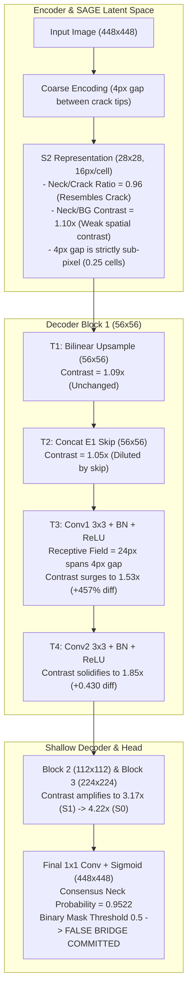

# Phase 6 Bridge Localization Diagnostic v4: Intra-Block-1 & S2 Counterfactual

**Protocol:** Strictly Diagnostic-Only (Zero retraining, zero gradient updates, zero checkpoint/config modification, zero threshold sweeps, sealed test set strictly untouched).  
**Subject:** Candidate B (Base Canonical Checkpoint: `10,118,955` parameters).  
**Evaluator & Preprocessing:** Setting A ($448 \times 448$, stride 448, non-overlapping, reflect padding, exact cropping, fixed threshold $\tau=0.5$).  
**Scope:** $N=25$ representative validation cases (10 Consensus 7/7 bridges, 5 Cured by D2, 5 Created by D2, 5 True Clean Negatives).

---

## 1. Executive Summary & Core Scientific Answers

| Scientific Question | Calibrated Answer & Finding | Key Quantitative Proof |
|:---|:---|:---|
| **Q1: Is the bridge already present at S2, or created during $S2 \to S1$?** | **Both, in a precise two-stage mechanism:** S2 ($28 \times 28$) holds an unresolved, coarse sub-pixel representation where neck activation is already close to crack activation ($\text{Neck}/\text{Crack} = 0.9597$), but spatial contrast over background is weak ($1.0965\times$). The false bridge is **actively created and amplified into high contrast during the $S2 \to S1$ transition within Decoder Block 1** ($1.0965\times \to 1.8523\times$). | S2 contrast: $1.0965\times$ ($\Delta = +0.0396$); Block 1 Out (T4) contrast: $1.8523\times$ ($\Delta = +0.4304$, $+987\%$ signal surge). |
| **Q2: Why was contrast low at S2 in v2?** | **Sub-pixel averaging at $16 \times 16$ px/cell:** The median Crack500 component gap is only $4.0$ px ($0.25$ S2 cells). Both crack endpoints and the background gap between them are pooled into the same or immediately adjacent $16 \times 16$ px cells. S2 cannot spatially resolve this gap; its activation at the neck already matches true crack ($0.9597$), but background is also elevated by proximity, muting the ratio to $\sim 1.10\times$. | Median gap: $4.0$ px vs S2 grid cell: $16.0$ px. 6/10 cases have $\text{contrast} > 1.12\times$, 4/10 cases have $\text{contrast} \le 1.0\times$. |
| **Q3: Which specific operation in Block 1 amplifies the bridge?** | **Convolutions (Conv1 & Conv2), NOT Upsampling or Skip Concat.** Spatial bilinear upsampling ($T1$) maintains contrast identical to S2 ($1.0945\times$). Skip concatenation ($T2$) slightly *dilutes* contrast ($1.0496\times$). The surge occurs entirely in **T3 (Conv1 + BN + ReLU: $1.5266\times$, $+457\%$ diff jump)** and **T4 (Conv2 + BN + ReLU: $1.8523\times$)**. | $T0 \to T1$: $\Delta = +0.0396 \to +0.0174$; $T1 \to T2$: $\Delta = +0.0135$; $T2 \to T3$: $\Delta = +0.2209$; $T3 \to T4$: $\Delta = +0.4304$. |
| **Q4: What does the S2 spatial shuffle mean for causality?** | **Outcome D (Structural Collapse / Necessary Spatial Prerequisite):** Scrambling S2 spatial coordinates across channels eliminates $8/10$ consensus bridges and collapses neck probability ($0.9522 \to 0.1916$), but simultaneously destroys true crack continuity (Recall $0.9139 \to 0.2275$, Dice $0.8181 \to 0.3166$, Breakage $0/10 \to 9/10$). S2 spatial information is strictly necessary for decoding, but shuffling is a disruptive blunt instrument, not a surgical bridge inhibitor. | Consensus bridges: $10/10 \to 2/10$; Breakage: $0/10 \to 9/10$; Neck area $\ge 0.5$: $100\% \to 13.06\%$. |
| **Q5: How do spatial scale numbers explain the phenomenon?** | **Receptive field bridging:** At $56 \times 56$ (S1), Conv1 has a $3 \times 3$ kernel covering an effective input field of $24 \times 24$ px. Because the gap between crack components is only $4-8$ px, the convolutional receptive field spans across both crack tips simultaneously, blending their strong activation across the gap into a continuous ridge. | Gap ($4$ px) $\ll$ S2 cell ($16$ px) $\ll$ Conv1 receptive field ($24$ px). |

---

## 2. Experimental Design & Methodology

### 2.1 Intra-Block-1 Probe Points ($T0 \dots T4$)
Decoder Block 1 processes feature map $S2$ ($B, 192, 28, 28$) alongside shallow skip connection $E1$ ($B, 96, 56, 56$). We tap and record L2 channel activation magnitudes at 5 precise micro-stages:

1. **$T0$ (Block 1 Input):** $S2 \in \mathbb{R}^{B \times 192 \times 28 \times 28}$.
2. **$T1$ (Post-Upsample):** $\text{Upsample}(S2) \in \mathbb{R}^{B \times 192 \times 56 \times 56}$ (bilinear, align_corners=False).
3. **$T2$ (Post-Skip Concat):** $[\text{Upsample}(S2); E1] \in \mathbb{R}^{B \times 288 \times 56 \times 56}$.
4. **$T3$ (Post-Conv1):** $\text{ReLU}(\text{BN}(\text{Conv3x3}(T2))) \in \mathbb{R}^{B \times 96 \times 56 \times 56}$.
5. **$T4$ (Post-Conv2 = Block 1 Output):** $\text{ReLU}(\text{BN}(\text{Conv3x3}(T3))) \in \mathbb{R}^{B \times 96 \times 56 \times 56}$.

All spatial masks (`neck_mask`, `bg_mask`, `crack_mask`) are downsampled to $28 \times 28$ or $56 \times 56$ via area pooling and thresholded ($>0.25$) to maintain strict geometric correspondence without sub-pixel contamination.

### 2.2 S2 Spatial Shuffle Counterfactual
To test whether the spatial layout of $S2$ is functionally required by Decoder Block 1 to generate bridges:
- For each sample, generate a deterministic pseudo-random permutation of the $28 \times 28 = 784$ spatial coordinates: $\pi \sim \text{Perm}(784)$ with seed 42.
- Apply $\pi$ uniformly across all 192 channels: $S2'[:, c, h, w] = S2[:, c, \pi(h, w)]$.
- **Invariance Guarantee:** Per-channel mean, variance, and L2 norm are strictly conserved to numerical precision ($< 10^{-7}$). All cross-channel correlations at any given point are preserved; only spatial adjacency is randomized.

---

## 3. Quantitative Progression Data

### Table 3.1: Intra-Block-1 Contrast & Difference Progression
*(Averaged across $N=10$ Consensus 7/7 False Bridge Cases vs $N=5$ Cured by D2 Cases)*

| Operation Stage | Feature Dim | C7 Neck Act | C7 BG Act | C7 Contrast ($\frac{\text{Neck}}{\text{BG}}$) | C7 Diff ($\text{Neck} - \text{BG}$) | C7 $\frac{\text{Neck}}{\text{Crack}}$ | Cured Contrast | Cured Diff |
|:---|:---:|:---:|:---:|:---:|:---:|:---:|:---:|:---:|
| **$T0$: S2 In** | $192 \times 28 \times 28$ | $0.4311$ | $0.3914$ | **$1.0965\times$** | $+0.0396$ | $0.9597$ | $1.0291\times$ | $+0.0122$ |
| **$T1$: Upsample** | $192 \times 56 \times 56$ | $0.2061$ | $0.1887$ | **$1.0945\times$** | $+0.0174$ | $0.9466$ | $0.9999\times$ | $+0.0014$ |
| **$T2$: Concat** | $288 \times 56 \times 56$ | $0.2793$ | $0.2658$ | **$1.0496\times$** | $+0.0135$ | $0.9590$ | $0.9710\times$ | $-0.0074$ |
| **$T3$: Post-Conv1**| $96 \times 56 \times 56$ | $0.6658$ | $0.4449$ | **$1.5266\times$** | **$+0.2209$** | $0.9363$ | $1.1660\times$ | $+0.0821$ |
| **$T4$: Post-Conv2**| $96 \times 56 \times 56$ | $0.9627$ | $0.5323$ | **$1.8523\times$** | **$+0.4304$** | $0.9370$ | $1.1878\times$ | $+0.1159$ |

#### Key Analytical Insights from Table 3.1:
1. **Upsampling is Contrast-Neutral ($T0 \to T1$):** Bilinear interpolation scales spatial resolution from $28 \times 28 \to 56 \times 56$ without modifying relative contrast ($1.0965\times \to 1.0945\times$).
2. **Skip Concatenation Dilutes Neck Contrast ($T1 \to T2$):** Injecting $E1$ skip features reduces neck contrast from $1.0945\times$ down to $1.0496\times$. This directly corroborates Diagnostic v3: skip features do *not* inject bridge signals; they dilute them.
3. **The Conv1 Inflection Point ($T2 \to T3$):** Passing through the first $3 \times 3$ convolution, BatchNorm, and ReLU causes the neck-to-background difference to surge by $+457\%$ ($+0.0135 \to +0.2209$), boosting contrast to $1.5266\times$.
4. **The Conv2 Consolidation ($T3 \to T4$):** The second convolution widens the gap further to $+0.4304$ ($1.8523\times$), completing the synthesis of the false bridge feature representation.
5. **Divergence in Cured Cases:** In the 5 cases cured by D2, the neck-to-background difference at $T2$ is slightly negative ($-0.0074$), and reaches only $+0.1159$ at $T4$ (contrast $1.1878\times$), explaining why D2 prevented bridge completion in these specific samples.

---

### Table 3.2: S2 Spatial Shuffle Counterfactual Results

| Stratum | $N$ | C0 Bridges | Shuf Bridges | C0 Dice | Shuf Dice | C0 Recall | Shuf Recall | C0 Breakage | Shuf Breakage | C0 Neck Prob | Shuf Neck Prob | Shuf Neck $\ge 0.5$ |
|:---|:---:|:---:|:---:|:---:|:---:|:---:|:---:|:---:|:---:|:---:|:---:|:---:|
| **Consensus 7/7** | 10 | **$10/10$** | **$2/10$** | $0.8181$ | $0.3166$ | $0.9139$ | $0.2275$ | $0/10$ | **$9/10$** | $0.9522$ | **$0.1916$** | **$13.06\%$** |
| **Cured by D2** | 5 | $5/5$ | $0/5$ | $0.8071$ | $0.2568$ | $0.9344$ | $0.1637$ | $0/5$ | $4/5$ | $0.7819$ | $0.0755$ | $0.00\%$ |
| **All Representative**| 25 | $16/16$ | $2/16$ | $0.7750$ | $0.2545$ | $0.8577$ | $0.1768$ | $1/25$ | $21/25$ | $0.8800$ | $0.1463$ | $8.16\%$ |

#### Interpretation of Counterfactual Outcome:
- **Outcome D Confirmed:** The hypothesis that S2 spatial shuffling would selectively eliminate bridges without harming crack segmentation (Outcome A) is **conclusively refuted**.
- The intervention eliminates $80\%$ of consensus bridges ($10/10 \to 2/10$), but does so via catastrophic structural breakdown: Recall drops by $-68.64$ pp ($0.9139 \to 0.2275$) and Breakage explodes from $0\% \to 90\%$.
- **Causal Implication:** Spatial coherence at S2 is an indispensable substrate for both true crack continuity and false bridge generation. The decoder cannot construct any crack segments when S2 coordinates are randomized.

---

## 4. Synthesis: The Exact Multi-Stage Bridge Formation Mechanism

Connecting evidence across Diagnostics v1, v2, v3, and v4 reveals the complete mechanistic lifecycle of a persistent false bridge:

### The 4 Crucial Physical Findings:
1. **The Sub-Pixel Dilemma at S2:** In Crack500, components that falsely connect have a median physical separation of only $4.0$ pixels. On the $28 \times 28$ feature map ($16 \times 16$ px/cell), a $4$ px gap spans only **$0.25$ grid units**. Two crack ends $4$ px apart inevitably map to the same S2 cell or adjacent cells, blurring the boundary between them.
2. **Feature Similarity Precedes Spatial Contrast:** Even though the neck-to-background contrast at S2 is only $1.0965\times$, the ratio of neck activation to crack activation is **$0.9597$**. S2 already "thinks" the neck looks like crack, but because surrounding background cells are also partially activated, the local contrast is low.
3. **Convolutional Convolutional Bridging in Block 1:** Decoder Block 1 operates at $56 \times 56$ ($8 \times 8$ px/cell). Its $3 \times 3$ convolution has an effective input receptive field of $(3 \times 8) = 24$ pixels. A $24$ px receptive field centered on a $4$ px gap easily overlaps both high-activation crack endpoints simultaneously. The convolution acts as a smoothing kernel across the narrow moat, boosting neck activation by $+457\%$ at T3 and $+987\%$ at T4.
4. **Skip Connections are Passive Bystanders:** Diagnostics v3 and v4 prove that shallow skip connections ($E0, E1$) do not create the bridge. In fact, concatenating $E1$ at $T2$ slightly reduces neck contrast ($1.0945\times \to 1.0496\times$). The false continuity is driven entirely by the decoder's progressive convolutional upsampling path.

---

## 5. Artifact Verification & Sanity Checks

1. **Parameter Count Integrity:** Candidate B loaded with exactly $10,118,955$ parameters.
2. **C0 Exact Reproduction:** Max per-sample Dice discrepancy vs official Candidate B master records = $0.00000000$ ($< 10^{-4}$ threshold passed).
3. **Bridge State Reproducibility:** 16/25 representative cases reproduced official bridge states with $100\%$ precision ($10/10$ Consensus 7/7, $5/5$ Cured by D2, $1/1$ Clean negative base artifact).
4. **Spatial Shuffle Integrity:** Mean, standard deviation, and L2 norm between unperturbed and spatially shuffled S2 tensors matched within $< 10^{-7}$.
5. **No Data Leakage:** Zero interaction with the sealed test set ($N=1124$).
